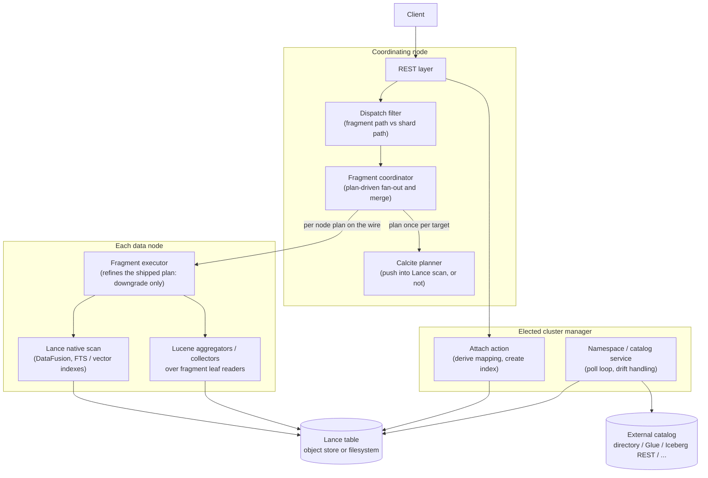
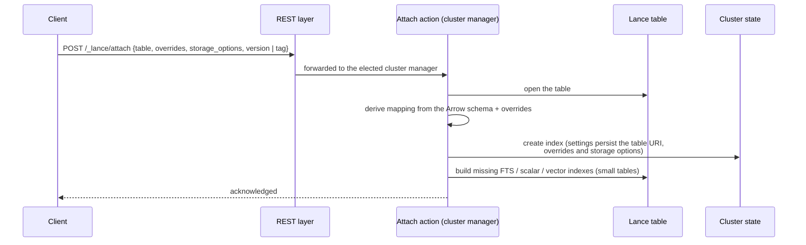
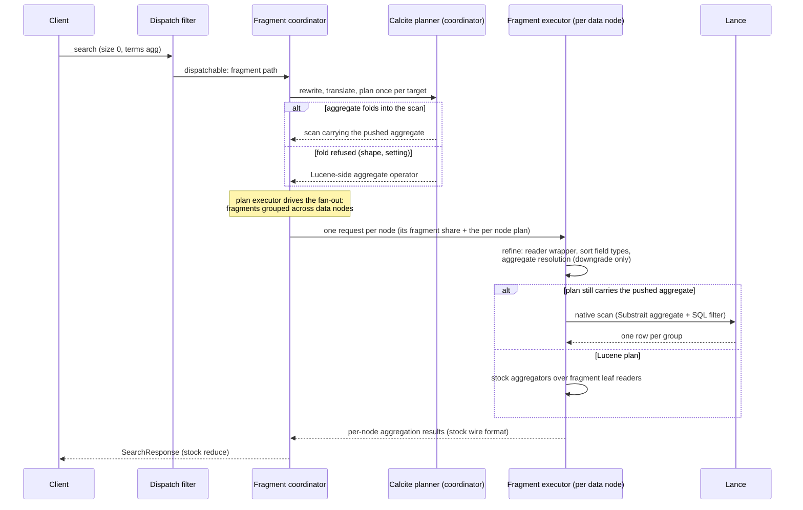
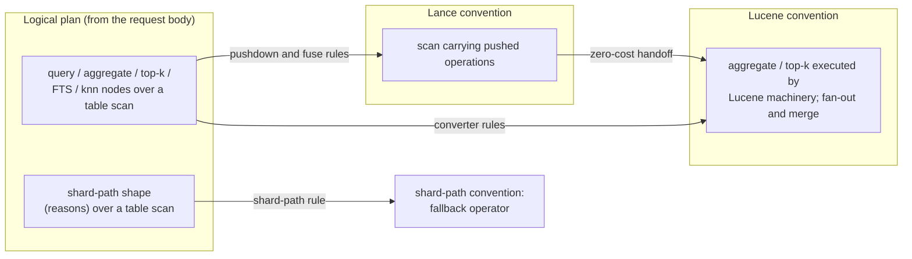

# Architecture

This document explains what the plugin is made of, how a request flows through it, and why the
design is shaped the way it is. It is written at the granularity of a design RFC: components,
request paths and design intent, with diagrams carrying most of the structure. It deliberately
stops short of class-by-class detail; the per-file reference is the class Javadoc, and the
per-feature reference is [features.md](features.md). After fifteen to twenty minutes here you
should have the overall picture and the three or four request paths in your head, and know which
subpackage to open for any given change.

## Contents

- [What this plugin does](#what-this-plugin-does)
- [High-level architecture](#high-level-architecture)
- [Directory layout](#directory-layout)
- [Request paths](#request-paths)
- [Planner design](#planner-design)
- [Storage and follow-forward](#storage-and-follow-forward)
- [Reading a PR](#reading-a-pr)
- [Reference links](#reference-links)

## What this plugin does

The plugin registers a [Lance](https://github.com/lancedb/lance) table as a read-only OpenSearch
index. An operator attaches one table or registers a whole catalog, the plugin derives an
OpenSearch mapping from the table's Arrow schema, and from then on `_search`, `GET /_doc/{id}`,
`_count` and the monitoring APIs answer from the Lance table directly. No documents are ingested
and no Lucene copy of the data is built.

Lance was chosen because it removes the copy, not just the ingestion. It is a columnar format
with multimodal columns, manifest-versioned snapshots, support for concurrent writers, and its
own full text and vector indexes with an embedded DataFusion query engine. One copy of the data
can therefore serve vector search, full text search and analytical aggregation at once, and the
plugin's job reduces to making that copy addressable through OpenSearch's APIs while following
the table forward as writers commit new versions.

The central design decision is to adapt each Lance fragment as a Lucene leaf reader at query
time. Almost all of OpenSearch's machinery — aggregators, collectors, field data, the query DSL —
is written against Lucene's reader interfaces, so a faithful leaf adapter lets the stock
machinery run over Lance data without a parallel implementation. Where Lance can do the work
better natively, the query planner folds the work into the Lance scan instead: the reader route
already reaches Lance's DataFusion SIMD aggregation and its Zone Map / BTree / Bitmap pruning. A
second, analytics-oriented route (a cross-plugin shared runtime with PPL / SQL entry points) is
future work tracked in the RFC; it builds on the same foundations rather than replacing them.

## High-level architecture



Six concerns make up the plugin.

The REST layer parses and forwards. Every handler (attach, namespace registration, search
pass-through, explain, stats, refs, index builds) validates its body and hands the work to a
transport action; nothing that touches a table, the cluster state or the network happens on a
REST or transport thread.

The namespace and catalog layer owns registration and freshness. Attach registers one table;
namespace registration points at a catalog (a filesystem directory, a Lance Namespace REST
catalog, AWS Glue, Iceberg REST, Polaris or Unity) and a poll loop on the elected cluster manager
surfaces new tables as indexes, advances indexes whose manifest moved, and classifies schema
drift (rename, reset, drop) between polls.

The dispatch layer decides, per request, which of two routes answers a `_search`. The fragment
path intercepts the request before OpenSearch's shard fan-out, distributes the table's fragments
across the data nodes, and merges the per-node answers. The shard path is stock OpenSearch over a
Lance-backed reader, kept as the correctness fallback for request shapes the fragment path does
not serve.

The query planner, built on Apache Calcite, decides once per request, on the coordinating node,
how the work executes on every data node: folded into the Lance native scan, or run through
Lucene's machinery over the fragment readers. The choice is a costed plan comparison, not a
hand-maintained list of shapes, and the chosen per node plan travels with each fragment request.
[Planner design](#planner-design) explains why.

The fragment executor on each data node carries the shipped plan out: it applies the guards only
the data node can judge (a reader wrapper, the Lucene sort field types, the aggregate's resolution
against the mapping), which may move a pushed operation back to Lucene but never push one, then
issues Lance scans (with pushed aggregates, filters, FTS or vector work encoded into them) or runs
the stock Lucene aggregators and collectors over per-fragment leaf readers, and returns the same
wire types a stock shard would, so the coordinator's reduce cannot tell which route answered.

Storage stays entirely on the Lance side: the table lives in an object store or on a filesystem,
and per-table credentials travel with the registration so one cluster addresses many buckets.

## Directory layout

Everything lives under `src/main/java/org/opensearch/lance/`. The tree stops at the subpackage
level; each subpackage's role is below, and the class Javadoc carries the rest.

```
src/main/java/org/opensearch/lance/
├── (top level)      # plugin entry point, registry, overrides, storage options, breaker
├── attach/          # the attach transport action
├── dispatch/        # search interception, coordinator, per-node fragment executor
├── engine/          # Lance-backed Lucene readers, snapshot cache, index builds and warm-up
├── execute/         # pushed-aggregate result decoding
├── index/           # the build_indexes transport actions
├── mapper/          # the lance_text and lance_vector field types
├── namespace/       # catalog registration, poll loop, drift handling
├── plan/            # the Calcite planner
│   ├── calcite/     #   conventions, schema, type system, cost, planner factory
│   ├── cost/        #   the fitted latency model and its inputs
│   ├── translate/   #   search body -> logical plan
│   ├── rel/         #   logical nodes; rel/physical/ holds the Lucene-side operators
│   ├── rules/       #   pushdown, fuse and converter rules
│   ├── metadata/    #   table statistics from Lance metadata; Calcite metadata handlers
│   ├── lancesql/    #   predicate -> Lance (DataFusion) SQL printer
│   ├── substrait/   #   aggregate -> Substrait bytes
│   ├── execute/     #   coordinator planning, the shipped per node plan, its refinement, fan-out, merge
│   └── explain/     #   the _lance/explain endpoint
├── query/           # the lance_* query builders and their Lucene query forms
├── refs/            # the _lance/refs endpoint (tags and branches)
├── rest/            # all REST handlers
└── stats/           # the _lance/stats endpoint
```

The top-level classes are what every path shares: `LancePlugin` (settings, services, thread
pools), `LanceRegistry` (the node's single Arrow allocator and shared Lance session, so native
caches are node-scoped rather than per-shard), `LanceOverrides` and `StorageOptions` (the parsed
forms of the attach body's mapping and credential clauses), and `LanceCircuitBreaker` (a breaker
over the native memory Lance holds, which JVM heap accounting cannot see).

`dispatch/` and `plan/` together are the search brain: dispatch decides fragment path versus
shard path, the planner decides native versus Lucene execution. `engine/` is the muscle both
routes share: one Lucene leaf reader per fragment, serving doc values, stored fields, terms and
points for every mapped column kind, plus the version-keyed snapshot cache that gives concurrent
requests stable reads. `namespace/` keeps the index set and the mappings in step with the
catalogs and tables behind them. `query/` is the DSL surface (`lance_match` and friends,
`lance_knn`) and `mapper/` the field types the mapping derivation emits for Lance-specific
columns.

Tests mirror the main tree under `src/test/java/`. Unit tests are `*Tests` classes next to what
they cover (the planner's are largely fixture-based: a request body JSON paired with the expected
plan text); REST integration tests are the `Lance*IT` classes against a single-node test cluster;
a separate multi-node task pins the coordinator's fan-out and merge against three nodes; and
performance and acceptance QA runs outside the repo on large tables per release round.

## Request paths

### Attach and namespace

Attach is a cluster-manager operation with a thin REST front, so a security plugin evaluates the
action before the plugin opens anything.



The derivation walks the Arrow schema, maps each column to an OpenSearch field type (the full
table is in [features.md](features.md)), and applies the caller's overrides. Everything that
produced the mapping is persisted in index settings, so later re-derivations — after a restart, a
failover or a schema change — start from the same declarations rather than from lost in-memory
state.

Namespace registration generalises attach to a catalog: the registration is stored in cluster
state, and the poll loop (elected cluster manager only, so a large cluster does not stampede the
catalog) enumerates the catalog's tables each cycle, surfaces new ones through the same
derive-and-create path, and advances existing indexes whose manifest version moved — swapping the
reader without closing the index. Deletion tombstones stop a deleted index from resurfacing on
the next cycle, and schema drift detection uses Lance's immutable field ids to tell a renamed
column from a replaced one. [Storage and follow-forward](#storage-and-follow-forward) covers the
freshness semantics.

### Search: an aggregation

Take `POST /demo/_search` with `size: 0` and a `terms` aggregation. Two decisions route it: the
dispatch filter picks fragment path or shard path per request, and the planner picks native or
Lucene execution per node.



The dispatch filter checks that every target index is Lance-backed and the request shape is one
the fragment executor answers correctly. That shape decision is itself a plan: the translator
marks a body holding an element only the shard path serves (suggesters, highlighters, collapse,
rescore, pipeline aggregations and the rest of the list in
[limitations.md](limitations.md)) with a shard-path shape node naming each element as a reason,
the planner lowers it to the shard-path convention's fallback operator, and a plan with that
operator at its root proceeds unchanged onto the shard path. The coordinator never
touches shards: fan-out and merge are plan operators, and a plan executor walks that plan to send
one request per data node and reduce the answers with OpenSearch's stock reduction. A node needs
no shard copy to take a share of the work — it builds its context from cluster state — which is
what makes the fragment distribution independent of the shard allocation.

The coordinator translates the request into the planner's algebra once per target and plans it;
the per node physical form travels with every fragment request as a `FragmentPlan`. When the
aggregate folds, the executor hands Lance a scan carrying the aggregate encoded as Substrait
and the filter printed as Lance SQL; DataFusion computes the groups natively and the executor
rebuilds the exact aggregation objects the Lucene route would have produced. When the fold is
refused — an unsupported function, or the pushdown setting turned off — the same plan run yields
the Lucene alternative and the stock aggregators run over the fragment readers. The executor adds
what only the data node knows: a security plugin's reader wrapper (DLS / FLS applies to Lucene
readers, so anything wrapper-sensitive must stay on the Lucene route) or a mapping the pushed
aggregate does not resolve against move the aggregate to the aggregators there. The response is
identical either way; only where the grouping happened differs.

The shard path remains the third route: stock OpenSearch, one node reading the whole table
through a Lance-backed directory reader. It exists for correctness on shapes the fragment path
does not serve, never as a load-shedding target.

### Search: hits

A hits request (`size` > 0, optionally `sort` and `search_after`) follows the same interception
and fan-out with a different plan shape. The translator wraps the query root in a top-k node
carrying the sort, the page size and the cursor; when every sort clause resolves to a Lance
column ordering, the pushdown folds the whole page into one ordered, limited native scan, with
the cursor spelled as a strict SQL bound — nothing sorts on the Java heap. Full text and vector
clauses join as query roots (not filters): scalar companions of the enclosing `bool` fold in as a
prefilter, evaluated before the index lookup or the vector top-k cutoff, because a post-filter
would return fewer than k hits. When the fold is refused at the coordinator (a `_score` sort mixed
with a column, a `post_filter`, a sort clause without a collation spelling), the plan's Lucene
alternative collects the page through the stock top-docs collector over the fragment readers,
exactly as a shard would; the executor moves a pushed page to that collector itself when the
mapping's Lucene sort field type cannot type the page's sort values, when a cursor sits at a
missing-value sentinel, or when a reader wrapper is installed. Either way the hit envelope
(`_source`, `_id`, sort values) is materialised through the fragment readers' stored-fields path.

## Planner design

The planner exists to answer one question per request and node — which execution strategy runs
this work — as a costed comparison rather than a routing table. Before it, each new query shape
added hand-written detection and translation in several places, and strategy choices leaked into
node settings for the user to tune. Building a private rule engine and cost model to fix that
would have re-implemented a subset of Apache Calcite, so the plugin embeds Calcite itself: the
planner core, the relational algebra and the cost machinery — not its SQL parser, JDBC stack or
code generation.

Execution placement is modelled with three Calcite conventions. A convention marks where an
operator runs, and converting between them is an explicit, costed step:

- The Lance convention: work the native scan computes (pushed aggregates, filters, full text,
  vector search, ordered limited pages). Its one physical operator is `LanceTableScan` carrying its
  pushed operations (`plan/rel/LanceTableScan.java`, `plan/rel/PushedOperation.java`); the fragment
  executor runs it as one Lance scan per fragment group, with the Substrait aggregate, the SQL
  filter, the full text or vector query and the orderings and limit the operations spell.
- The Lucene convention: work executed by Lucene's machinery over the fragment leaf readers, plus
  the coordinator's distribution. Its operators live in `plan/rel/physical/`: `LuceneAggregateExec`
  (the stock aggregators over the leaf readers, run by the fragment executor's aggregation phase),
  `HeapTopKExec` (Lucene's top docs collector, run by the executor's hits phase),
  `LuceneHandoffExec` (the zero cost conversion from a Lance scan, unwrapped by the planner factory
  so callers see the scan itself), `FanOutExec` (one per node request per fragment group, run by
  the coordinator's plan executor as the transport fan-out) and `MergeExec` (the reduce of the per
  node answers, run by the plan executor as the merge reducer).
- The shard-path convention: work answered by OpenSearch's regular shard search. Its single
  operator, `ShardPathFallbackExec`, is produced by `PlanToShardPathRule` for a request whose body
  holds an element only the shard path serves; the operator carries the reasons and its presence
  at the plan root is what routes the request there, so the shard fallback is a plan the planner
  produces rather than a shape checklist in the dispatch filter. The dispatch filter runs it by
  forwarding the whole request to the stock `TransportSearchAction`.



Translators turn the search body into a logical tree; pushdown rules fold what Lance can compute
into the scan; converter rules produce the Lucene alternative for the same tree; and the Volcano
planner picks by cost. A
tree the planner cannot handle at all falls back to Lucene execution — a planner failure never
surfaces as a request error. `GET /{index}/_lance/explain` runs exactly the coordinator's
planning entry without executing anything and prints the route, both plans, the per node
`FragmentPlan` it would ship and the refinements a data node could still apply; it is the first
tool to reach for when developing a rule.

The cost the planner compares is predicted latency in milliseconds (the two other axes of
`LanceCost`, native and heap bytes, are budgets checked as hard constraints and are not modelled
yet). For an aggregation over a table of a million rows or more, the pushed scan and the Lucene
aggregator operator are each priced by `plan/cost/CostModel` as a sum of coefficient times
quantity terms: a fixed cost per request, an object store open latency when the table URI is
`s3://`, `gs://`, `az://` or the like, the per row work of every thread (the table's rows divided
by the fan-out node count and by the path's parallelism: `lance.aggregation.pushdown_parallelism`
for the scan, `lance.fragment_path.slices` for the aggregators) with one coefficient per kind of
group key and metric, the object store transfer of the columns the scan reads (per node, not per
thread, because it is bandwidth bound), a hash table penalty above a million groups, and the
executor's merge of its parallel scans' group rows. The quantities come from the tree and the
table statistics (rows, the bitmap distinct count of a terms key, the Arrow type widths of the
columns read); the run's inputs (nodes, storage kind, CPUs, the two settings) come from the caller
as `plan/cost/CostInputs`, so the coordinator's plan sees the cluster and a data node's plan sees
one local node. The coefficients in `CostCoefficients` were fitted by non negative least squares
to the warm latencies measured on the 20M, 100M and 1B row benchmark tables across 1 to 6 node
clusters with the pushdown on and off; `scripts/fit-cost-coefficients.py` reproduces the fit from
`src/test/resources/cost/measurements.csv`, and `CostModelTests` holds the model to the measured
choices. What the model does not see: whether the aggregator path's columns are warm in the
node's column store (a cold node pays a storage read the model does not charge), the state of the
Lance index cache, and concurrent requests (the coefficients are single request latencies). Below
a million rows every path answers within the fixed cost and the measurements say nothing, so the
placeholder ordering stands: the pushed form wins whenever a rule folds the tree. The hits shapes
(sorted pages, full text, vector) have no measured comparison between their two forms and keep the
same placeholder ordering at every size.

The statistics the planner reads come from Lance table metadata, not from scanning rows. Once per
manifest version a node collects, from the open dataset, the fragment list with each fragment's
live row count and data file count (`getFragmentStatistics`), the physical rows behind them (the
difference is the deleted row count), the indexes on the table with their type, fragment coverage
and size (`getIndexes`), and per index the figures Lance's `getIndexStatistics` reports (indexed
and unindexed rows; for a bitmap index the number of bitmaps, which is the column's distinct
value estimate). Zone maps (`getZonemapStats`) are read lazily on the first request for a column
and memoised with the version. The result is cached per `(table URI, manifest version)`, so a
version pays the collection on its first request and every later request reads the entry; the
entry goes when the snapshot cache closes that version, and a table that follows its manifest
keeps at most the current and the previous version. The cache is per node and is filled by the coordinator role from the dataset it opens to
enumerate fragments (and by the explain endpoint from the warm cache snapshot it plans against);
the data nodes run no planner. `GET /_lance/stats` reports
the entry count and the accumulated collection time under `plan.statistics`. The Calcite side
reads the statistics through `LanceTable.getStatistic()` (row count) and through Lance's own
`RowCount` and `DistinctRowCount` metadata handlers for the scan, chained in front of Calcite's
defaults.

Planning happens in two stages. Stage one runs on the coordinating node: the request's query is
rewritten with the same shard-free rewrite the shard path applies, the whole body is translated
once through the same entry the explain endpoint uses, the Volcano run chooses the per node
physical form, and that form is written down as a `FragmentPlan` (the Lance SQL of the scalar
predicate, the full text or knn clause the executor builds its Lance query from, and the pushed
page or the pushed aggregate with its Substrait bytes) that every fragment request of the target
carries. Stage two runs on each data node, without a planner: the executor checks the shipped plan
against what only it knows (a reader wrapper on the index service, the Lucene sort field types the
mapping built, the resolution of the pushed aggregate against the mapping and the group bound) and
downgrades where a pushed operation cannot run there. Downgrades go one way, from the Lance scan to
Lucene; nothing is pushed on the data node that the coordinator did not push, so the plan the
explain endpoint prints is the plan the coordinator ships (the endpoint calls the same
`RequestPlanner` entry with the same cost inputs and renders its result), and `GET /_lance/stats` counts every
downgrade under `plan.refinements` by reason and, under `plan.executed`, how many requests each
node answered through the Lance scan and through Lucene. The per node plan is a wire format internal to the
plugin: every node is assumed to run the same plugin version, there is no version negotiation, and
a fragment request between nodes of different plugin versions fails rather than falling back to the
shard path, so a rolling upgrade is not supported for the fragment path.

The planner was delivered in phases, and the later ones are still in flight: first the
foundations (dependencies, schema, conventions, cost, the explain endpoint), then the aggregation
route through the planner, then hits, full text and vector translation, then the Lucene
convention operators with fan-out and merge as plan operators, then the shard-path fallback as a
plan operator, then the cost model fitted to the measured aggregation shapes, then the two stage
planning that ships the per node plan from the coordinator, and ahead: node local refinement of the
plan on column store warmth, and accuracy and tie-stability as planner
traits a request can demand. The CHANGELOG tracks what has landed.

## Storage and follow-forward

A Lance table is immutable per manifest version, and every write produces a new version. The
plugin turns that into snapshot semantics: the per-node cache keys its open datasets and fragment
lists by manifest version, so an in-flight request keeps reading the version it started on while
the next request sees the new one. Follow-forward is what keeps an index useful under active
writers — without it, an attached index would silently freeze at attach time. By default the poll
loop notices a version advance and swaps the reader in place, with no shard close or
reallocation. `"version": N` on attach pins a readonly snapshot that never advances; `"tag"`
follows a Lance tag re-resolved every cycle, giving operators a moving pointer they control from
the Lance side.

Per-table credentials flow through the `storage_options` clause: parsed at attach, persisted in
index settings, and handed to Lance's object store on every open, with credential-like values
redacted from every API rendering and log line. The keys are Lance's own names, so one JVM
addresses many buckets with different credentials and no OpenSearch-side translation. Details are
in [features.md](features.md).

## Reading a PR

The recurring change patterns, and the subpackages each one crosses:

A planner change (a new rule, a new logical node, translator coverage) lives in `plan/rules/`,
`plan/rel/` and `plan/translate/`, with the rule registered in the planner factory and, when a
new predicate must print as Lance SQL, `plan/lancesql/`. Routing picks the change up through the
planner, so such a PR should barely touch `dispatch/`; when it does more than read a plan's root,
ask why the routing needed to know.

A new mapping override or field type crosses four places: the override model at the package root,
the derivation in `rest/`, the read path in `engine/` (where correctness lives — read that part
first), and the docs (`features.md`, plus `limitations.md` for the gaps). Decide explicitly
whether predicates on the new type may print as Lance SQL; when the encoded order differs from
the stored order, they must not.

A new catalog integration touches `namespace/` (the factory and the enumerator), `build.gradle`
with its licence metadata, and the namespace section of `features.md`. Cluster state shapes
should not change for a new catalog type.

An executor or fan-out change touches the largest files in the repo, in `dispatch/` and
`engine/`. These are the hot files: review them method by method, and expect only one in-flight
PR at a time to touch each.

Review red flags, each one a class of bug this codebase defends against: blocking work in a REST
handler or on a transport thread; a fragment-path feature that skips the security wrapper gate; a
planner rule that does not follow the existing chain-enumeration pattern (the termination
argument of every rule depends on it — the rule Javadoc in `plan/rules/` explains); and a new
node-visible surface (setting, endpoint, response field) without its line in `docs/`.

## Reference links

In this repository:

- [features.md](features.md) — what each surface does, by concern.
- [limitations.md](limitations.md) — known gaps and shard-path fall-throughs.
- [getting-started.md](getting-started.md) — end-to-end walkthrough.
- [CHANGELOG.md](../CHANGELOG.md) — what has landed, release by release.
- Class Javadoc — the per-file reference this document deliberately stops short of.

Outside:

- [RFC #22643](https://github.com/opensearch-project/OpenSearch/issues/22643) — the design
  discussion and rationale this plugin implements.
- [Calcite planner umbrella issue](https://github.com/lawofcycles/lance-opensearch/issues/151) —
  the phased planner delivery.
- [Lance](https://github.com/lancedb/lance) — the table format.
- [lance-namespace](https://github.com/lancedb/lance-namespace) — the catalog API the namespace
  implementations build on.
- [Apache Calcite](https://calcite.apache.org/) — the planner foundation.
