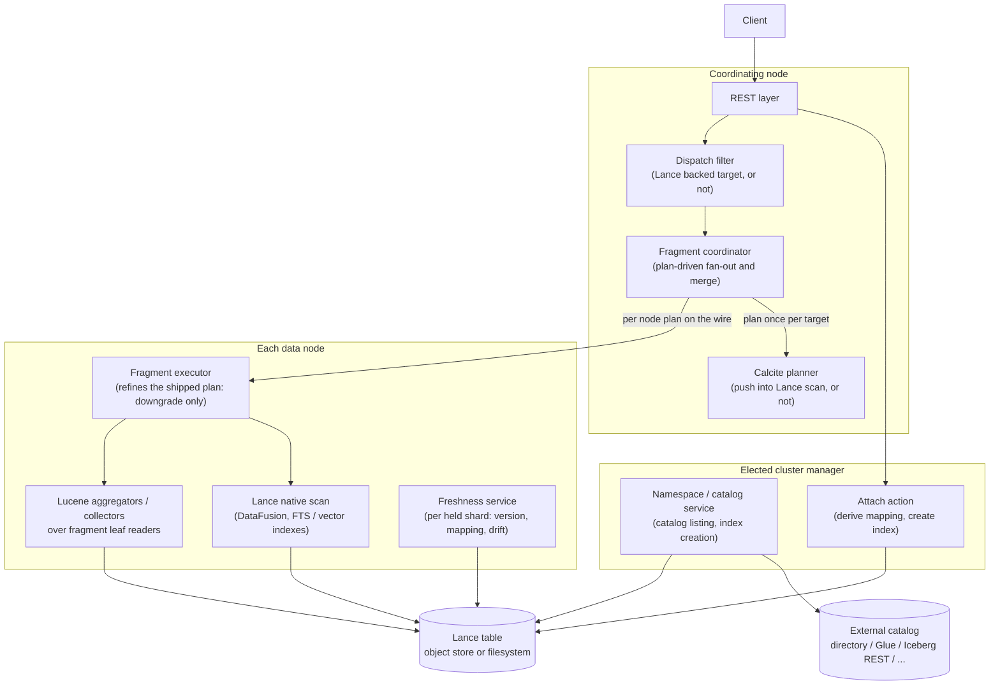
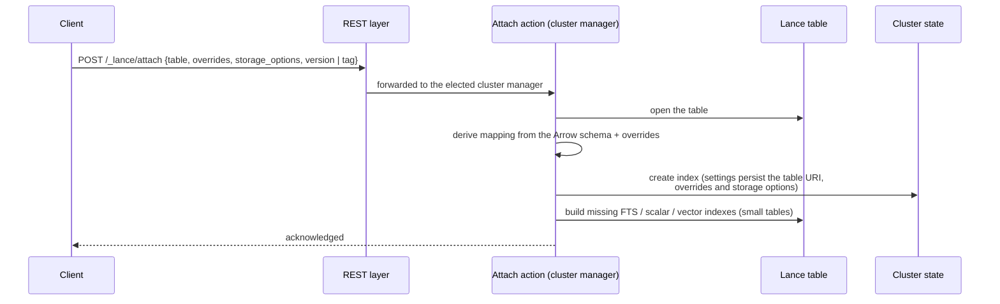
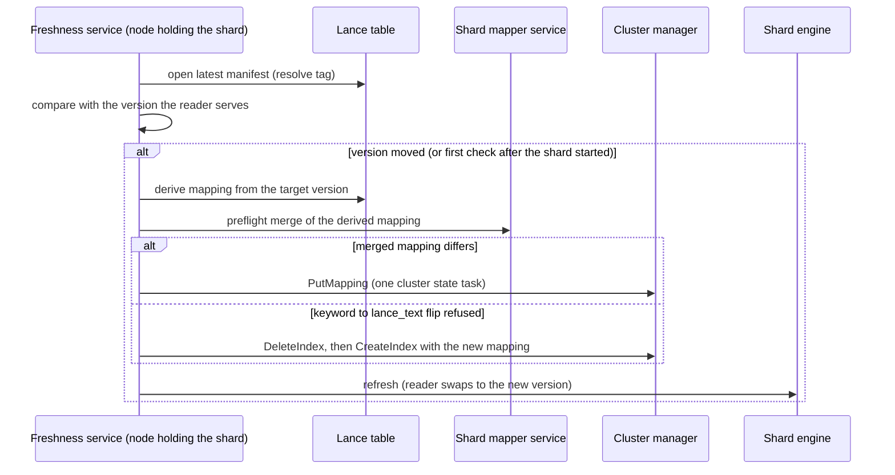
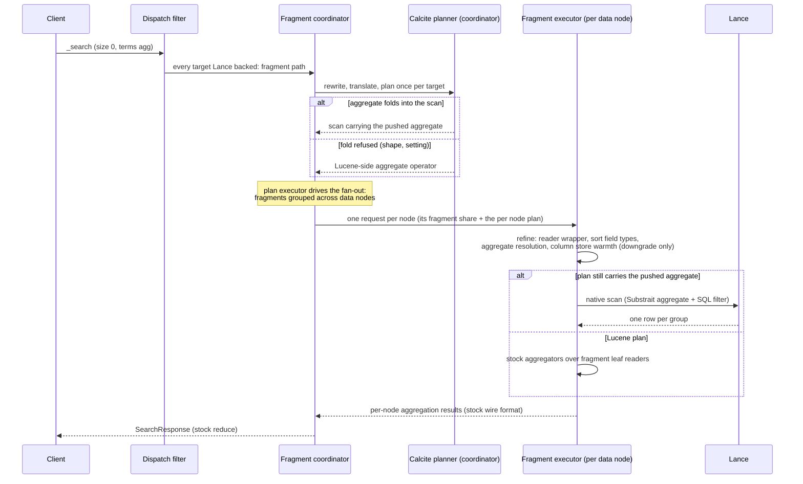
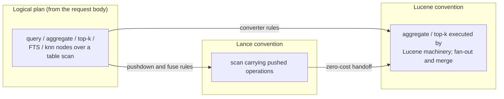

# Architecture

This document explains what the plugin is made of, how a request flows through it, and why the
design is shaped the way it is. It is written at the granularity of a design RFC: components,
request paths and design intent, with diagrams carrying most of the structure. It deliberately
stops short of class-by-class detail; the per-file reference is the class Javadoc, and the
per-feature reference is [features.md](features.md). After fifteen to twenty minutes here you
should have the overall picture and the three or four request paths in your head, and know which
subpackage to open for any given change.

## Contents

- [What this plugin does](#what-this-plugin-does)
- [High-level architecture](#high-level-architecture)
- [Directory layout](#directory-layout)
- [Request paths](#request-paths)
- [Planner design](#planner-design)
- [Memory](#memory)
- [Storage and follow-forward](#storage-and-follow-forward)
- [Reading a PR](#reading-a-pr)
- [Reference links](#reference-links)

## What this plugin does

The plugin registers a [Lance](https://github.com/lancedb/lance) table as a read-only OpenSearch
index. An operator attaches one table or registers a whole catalog, the plugin derives an
OpenSearch mapping from the table's Arrow schema, and from then on `_search`, `GET /_doc/{id}`,
`_count` and the monitoring APIs answer from the Lance table directly. No documents are ingested
and no Lucene copy of the data is built.

Lance was chosen because it removes the copy, not just the ingestion. It is a columnar format
with multimodal columns, manifest-versioned snapshots, support for concurrent writers, and its
own full text and vector indexes with an embedded DataFusion query engine. One copy of the data
can therefore serve vector search, full text search and analytical aggregation at once, and the
plugin's job reduces to making that copy addressable through OpenSearch's APIs while following
the table forward as writers commit new versions.

The central design decision is to adapt each Lance fragment as a Lucene leaf reader at query
time. Almost all of OpenSearch's machinery — aggregators, collectors, field data, the query DSL —
is written against Lucene's reader interfaces, so a faithful leaf adapter lets the stock
machinery run over Lance data without a parallel implementation. Where Lance can do the work
better natively, the query planner folds the work into the Lance scan instead: the reader route
already reaches Lance's DataFusion SIMD aggregation and its Zone Map / BTree / Bitmap pruning. A
second, analytics-oriented route (a cross-plugin shared runtime with PPL / SQL entry points) is
future work tracked in the RFC; it builds on the same foundations rather than replacing them.

## High-level architecture



Six concerns make up the plugin.

The REST layer parses and forwards. Every handler (attach, namespace registration, search
pass-through, explain, stats, refs, index builds) validates its body and hands the work to a
transport action; nothing that touches a table, the cluster state or the network happens on a
REST or transport thread.

The namespace and catalog layer owns registration and freshness. Attach registers one table;
namespace registration points at a catalog (a filesystem directory, a Lance Namespace REST
catalog, AWS Glue, Iceberg REST, Polaris or Unity) and a poll loop on the elected cluster manager
lists the catalog and surfaces new tables as indexes. Keeping an index fresh is the job of the
node that holds its shard: a freshness service there checks each held index at the same cadence,
advances the reader when the manifest (or the followed tag) moved, re-derives the mapping and
sends a mapping update only when it changed, and classifies schema drift (rename, reset, drop)
between checks. `POST /_lance/namespace/_poll` and `POST /{index}/_lance/sync` run the two
jobs on demand. [docs/design/namespace-freshness.md](design/namespace-freshness.md) records why
the split is drawn there.

The dispatch layer intercepts every `_search` whose targets are all Lance backed before
OpenSearch's shard fan-out and hands it to the fragment path, which distributes the table's
fragments across the data nodes and merges the per-node answers. Every body over such a target
takes that path; a body no plan answers (`suggest`, `highlight`) is refused at the coordinator
with 400 naming the element. Only a target that mixes a Lance backed index with an ordinary one
stays on OpenSearch's stock search action, which reads the Lance index through the shard engine's
whole table reader.

The query planner, built on Apache Calcite, decides once per request, on the coordinating node,
how the work executes on every data node: folded into the Lance native scan, or run through
Lucene's machinery over the fragment readers. The choice is a costed plan comparison, not a
hand-maintained list of shapes, and the chosen per node plan travels with each fragment request.
[Planner design](#planner-design) explains why.

The fragment executor on each data node carries the shipped plan out: it applies the guards only
the data node can judge (a reader wrapper, the Lucene sort field types, the aggregate's resolution
against the mapping), which may move a pushed operation back to Lucene but never push one, then
issues Lance scans (with pushed aggregates, filters, FTS or vector work encoded into them) or runs
the stock Lucene aggregators and collectors over per-fragment leaf readers, and returns the same
wire types a stock shard would, so the coordinator's reduce cannot tell which route answered.

Storage stays entirely on the Lance side: the table lives in an object store or on a filesystem,
and per-table credentials travel with the registration so one cluster addresses many buckets.
The caches the plugin holds are all in memory (the table snapshots, the column store, the Lance
Session cache); there is no disk tier, so a table in an object store is read from it on every
request that misses those caches.

## Directory layout

Everything lives under `src/main/java/org/opensearch/lance/`. The tree stops at the subpackage
level; each subpackage's role is below, and the class Javadoc carries the rest.

```
src/main/java/org/opensearch/lance/
├── (top level)      # plugin entry point, registry, overrides, storage options, breaker
├── attach/          # the attach transport action
├── dispatch/        # search interception, coordinator, per-node fragment executor
├── engine/          # Lance-backed Lucene readers, snapshot cache, index builds and warm-up
├── execute/         # pushed-aggregate result decoding
├── index/           # the build_indexes transport actions
├── mapper/          # the lance_text and lance_vector field types
├── namespace/       # catalog registration, poll loop, per shard freshness, drift handling
├── plan/            # the Calcite planner
│   ├── calcite/     #   conventions, schema, type system, cost, planner factory
│   ├── cost/        #   the fitted latency model and its inputs
│   ├── translate/   #   search body -> logical plan
│   ├── rel/         #   logical nodes; rel/physical/ holds the Lucene-side operators
│   ├── rules/       #   pushdown, fuse and converter rules
│   ├── metadata/    #   table statistics from Lance metadata; Calcite metadata handlers
│   ├── lancesql/    #   predicate -> Lance (DataFusion) SQL printer
│   ├── substrait/   #   aggregate -> Substrait bytes
│   ├── execute/     #   coordinator planning, the shipped per node plan, its refinement, fan-out, merge
│   └── explain/     #   the _lance/explain endpoint
├── query/           # the lance_* query builders and their Lucene query forms
├── refs/            # the _lance/refs endpoint (tags and branches)
├── rest/            # all REST handlers
└── stats/           # the _lance/stats endpoint
```

The top-level classes are what every path shares: `LancePlugin` (settings, services, thread
pools), `LanceRegistry` (the node's single Arrow allocator and shared Lance session, so native
caches are node-scoped rather than per-shard), `LanceOverrides` and `StorageOptions` (the parsed
forms of the attach body's mapping and credential clauses), and `LanceCircuitBreaker` (a breaker
over the native memory Lance holds, which JVM heap accounting cannot see).

`dispatch/` and `plan/` together are the search brain: dispatch intercepts the search and drives
the fan-out, the planner decides native versus Lucene execution and refuses what has no plan.
`engine/` is the muscle the fragment path and the shard engine share: one Lucene leaf reader per fragment, serving doc values, stored fields, terms and
points for every mapped column kind, plus the version-keyed snapshot cache that gives concurrent
requests stable reads. `namespace/` keeps the index set and the mappings in step with the
catalogs and tables behind them. `query/` is the DSL surface (`lance_match` and friends,
`lance_knn`) and `mapper/` the field types the mapping derivation emits for Lance-specific
columns.

Tests mirror the main tree under `src/test/java/`. Unit tests are `*Tests` classes next to what
they cover (the planner's are largely fixture-based: a request body JSON paired with the expected
plan text); REST integration tests are the `Lance*IT` classes against a single-node test cluster;
a separate multi-node task pins the coordinator's fan-out and merge against three nodes; and
performance and acceptance QA runs outside the repo on large tables per release round.

## Request paths

### Attach and namespace

Attach is a cluster-manager operation with a thin REST front, so a security plugin evaluates the
action before the plugin opens anything.



The derivation walks the Arrow schema, maps each column to an OpenSearch field type (the full
table is in [features.md](features.md)), and applies the caller's overrides. Everything that
produced the mapping is persisted in index settings, so later re-derivations — after a restart, a
failover or a schema change — start from the same declarations rather than from lost in-memory
state.

Namespace registration generalises attach to a catalog: the registration is stored in cluster
state, and the poll loop (elected cluster manager only, so a large cluster does not stampede the
catalog) enumerates the catalog's tables each cycle and surfaces new ones through the same
derive-and-create path. Deletion tombstones stop a deleted index from resurfacing on the next
cycle. The manager opens no table it is not about to surface.

Freshness runs where the shard is. Every started Lance-backed shard registers with the node's
freshness service through the shard lifecycle hooks, and the service checks it at the poll
cadence: open the latest manifest, resolve the followed tag if any, compare with the version the
shard's reader serves, and when they differ re-derive the mapping from the version about to be
served, apply it only when it differs from the current one (a preflight merge into the shard's
own mapper service decides), then refresh the shard — which is where the engine swaps the reader
without closing the index — and retire the previous snapshot. Schema drift detection uses Lance's
immutable field ids to tell a renamed column from a replaced one.



[Storage and follow-forward](#storage-and-follow-forward) covers the freshness semantics, and
[docs/design/namespace-freshness.md](design/namespace-freshness.md) the reasons the check lives
on the shard's node.

### Search: an aggregation

Take `POST /demo/_search` with `size: 0` and a `terms` aggregation. Two decisions route it: the
dispatch filter checks that every target is Lance backed, and the planner picks native or Lucene
execution per node.



The dispatch filter checks that every target index is Lance-backed; nothing about the body takes
part in that decision. Whether a body has an answer is decided at plan time on the coordinator:
the translator refuses a body carrying an element no plan answers (`suggest`, `highlight`, the
list in [limitations.md](limitations.md)) with 400 naming the element, before the body is
translated, and the explain endpoint reports the same body as `route: unsupported` with the same
message. The coordinator never touches shards: fan-out and merge are plan operators, and a plan executor walks that plan to send
one request per data node and reduce the answers with OpenSearch's stock reduction. A node needs
no shard copy to take a share of the work — it builds its context from cluster state — which is
what makes the fragment distribution independent of the shard allocation.

The coordinator translates the request into the planner's algebra once per target and plans it;
the per node physical form travels with every fragment request as a `FragmentPlan`. When the
aggregate folds, the executor hands Lance a scan carrying the aggregate encoded as Substrait
and the filter printed as Lance SQL; DataFusion computes the groups natively and the executor
rebuilds the exact aggregation objects the Lucene route would have produced. When the fold is
refused — an unsupported function, or the pushdown setting turned off — the same plan run yields
the Lucene alternative and the stock aggregators run over the fragment readers. The executor adds
what only the data node knows: a security plugin's reader wrapper (DLS / FLS applies to Lucene
readers, so anything wrapper-sensitive must stay on the Lucene route) or a mapping the pushed
aggregate does not resolve against move the aggregate to the aggregators there. The response is
identical either way; only where the grouping happened differs.

There is no third route. Until every request shape ran on the fragment executors, a body they
did not serve proceeded onto stock OpenSearch, one node reading the whole table through the Lance
backed directory reader; that fallback is gone, and the executor decides at plan time whether a
body has an answer. The directory reader itself stays for `GET /_doc/{id}`, `_stats` and a
`_search` over a target that mixes a Lance backed index with an ordinary one.

### Search: hits

A hits request (`size` > 0, optionally `sort` and `search_after`) follows the same interception
and fan-out with a different plan shape. The translator wraps the query root in a top-k node
carrying the sort, the page size and the cursor; when every sort clause resolves to a Lance
column ordering, the pushdown folds the whole page into one ordered, limited native scan, with
the cursor spelled as a strict SQL bound — nothing sorts on the Java heap. Full text and vector
clauses join as query roots (not filters): scalar companions of the enclosing `bool` fold in as a
prefilter, evaluated before the index lookup or the vector top-k cutoff, because a post-filter
would return fewer than k hits. When the fold is refused at the coordinator (a `_score` sort mixed
with a column, a `post_filter`, a sort clause without a collation spelling), the plan's Lucene
alternative collects the page through the stock top-docs collector over the fragment readers,
exactly as a shard would; the executor moves a pushed page to that collector itself when the
mapping's Lucene sort field type cannot type the page's sort values, when a cursor sits at a
missing-value sentinel, or when a reader wrapper is installed. Either way the hit envelope
(`_source`, `_id`, sort values) is materialised through the fragment readers' stored-fields path.

## Planner design

The planner exists to answer one question per request and node — which execution strategy runs
this work — as a costed comparison rather than a routing table. Before it, each new query shape
added hand-written detection and translation in several places, and strategy choices leaked into
node settings for the user to tune. Building a private rule engine and cost model to fix that
would have re-implemented a subset of Apache Calcite, so the plugin embeds Calcite itself: the
planner core, the relational algebra and the cost machinery — not its SQL parser, JDBC stack or
code generation.

Execution placement is modelled with two Calcite conventions. A convention marks where an
operator runs, and converting between them is an explicit, costed step:

- The Lance convention: work the native scan computes (pushed aggregates, filters, full text,
  vector search, ordered limited pages). Its one physical operator is `LanceTableScan` carrying its
  pushed operations (`plan/rel/LanceTableScan.java`, `plan/rel/PushedOperation.java`); the fragment
  executor runs it as one Lance scan per fragment group, with the Substrait aggregate, the SQL
  filter, the full text or vector query and the orderings and limit the operations spell.
- The Lucene convention: work executed by Lucene's machinery over the fragment leaf readers, plus
  the coordinator's distribution. Its operators live in `plan/rel/physical/`: `LuceneAggregateExec`
  (the stock aggregators over the leaf readers, run by the fragment executor's aggregation phase),
  `HeapTopKExec` (Lucene's top docs collector, run by the executor's hits phase),
  `LuceneHandoffExec` (the zero cost conversion from a Lance scan, unwrapped by the planner factory
  so callers see the scan itself), `FanOutExec` (one per node request per fragment group, run by
  the coordinator's plan executor as the transport fan-out) and `MergeExec` (the reduce of the per
  node answers, run by the plan executor as the merge reducer).

A body with no plan under either convention (`suggest`, `highlight`) is not a third convention:
the translator refuses it before the Volcano run (`SearchRequestToRel.checkEnvelopeSupported`),
the search endpoint answers 400 and the explain endpoint `route: unsupported`.



Translators turn the search body into a logical tree; pushdown rules fold what Lance can compute
into the scan; converter rules produce the Lucene alternative for the same tree; and the Volcano
planner picks by cost. A
tree the planner cannot handle at all falls back to Lucene execution — a planner failure never
surfaces as a request error. `GET /{index}/_lance/explain` runs exactly the coordinator's
planning entry without executing anything and prints the route, both plans (every physical
operator with the traits it declares and the cost the planner charged it), the per node
`FragmentPlan` it would ship, the refinements a data node could still apply and the trait
demand the body placed; it is the first tool to reach for when developing a rule.

[query-plan.md](query-plan.md) is the reference for all of this from the reader's side: the
explain response field by field with an example, one line per physical operator, how the cost is
computed and what moves it between explain and runtime, the four refinements and the order they
fire in, the two traits and when the enforcer fires, and the wire format the plan travels in.
The rest of this section explains the design; go there for the vocabulary.

Two request demandable traits sit next to the convention in every operator's trait set
(`plan/traits/`). `Accuracy` says whether an operator's figures are exact or come from a sketch:
`EXACT` for every hit page, every count and every aggregate whose metrics are sums, averages,
extremes, value counts, stats or bucket counts; `APPROXIMATE` for an aggregate carrying a
`cardinality` (HyperLogLog++), `percentiles` or `percentile_ranks` (t-digest) metric, which the
pushed Lance scan and the Lucene aggregators compute as the same sketches, so both physical forms
of such a tree declare the same value (`LanceAggregate.accuracy()`). `TieStability` says whether
the order of rows that compare equal under the request's sort is reproducible between two calls:
`STABLE_ROWADDR` for a bare scan and a page without a sort over a scalar query (Lance row address
order, which is Lucene doc order over the whole table reader);
`STABLE_KEY` for a page ordered by a stored column, with or without a further tie breaker, on the
pushed scan and on `HeapTopKExec` alike (`LanceTopK.tieStability()`); `UNSTABLE` for a page cut in
score order out of a full text or knn scan, whose equal scores land in whatever order the
scanner's batches arrive, and for aggregate outputs, whose group rows have no order contract.
`LuceneHandoffExec`, `FanOutExec` and `MergeExec` inherit their input's values: the handoff moves
rows unchanged, the fan-out moves per node rows, and the merge sums exact counts into an exact
count, reduces sketches into a sketch and keeps the per node pages' tie order. Each stable value
satisfies a demand for itself and for `UNSTABLE`; `EXACT` satisfies a demand for either accuracy.
Neither trait has an enforcer (nothing raises a sketch to an exact figure or makes a score order
reproducible after the fact), so a demand no operator meets is refused rather than converted.

Two request elements demand a trait (`RequestPlanner.requirementOf`). An explicit
`track_total_hits` (an integer bound or `true`) demands `Accuracy.EXACT` at the root: the count the
response reports must be exact within the bound, which every plan meets except an aggregate over
a sketch metric, so `track_total_hits: 500` next to a `cardinality` aggregation is refused with a
400 whose message names the trait, where the request used to answer a sketch under an exact
count. A `search_after` cursor over a page the tree carries demands `TieStability.STABLE_KEY`: a
cursor continues from the sort values of the previous page's last hit, so the rows on either side
of it must be the same rows on every call; a cursor over a full text page ordered by score alone
is refused with a 400 naming the trait, while a cursor over a column sort (a single column folded
into the scan, or a column with a tie breaker on the heap page) plans as before. The planner
factory runs the Volcano pass once for the convention, and only when the cheapest plan does not
declare the demanded values asks the same cluster again with them on the root, so a costlier plan
that meets the demand wins over a cheaper one that does not, and `CannotPlanException` on that
second root is what becomes the 400. The data node refinements do not read the traits; each
downgrade keeps them by construction (`FragmentPlanRefiner`).

The cost the planner compares is predicted latency in milliseconds (the two other axes of
`LanceCost`, native and heap bytes, are budgets checked as hard constraints and are not modelled
yet). For an aggregation over a table of a million rows or more, the pushed scan and the Lucene
aggregator operator are each priced by `plan/cost/CostModel` as a sum of coefficient times
quantity terms: a fixed cost per request, an object store open latency when the table URI is
`s3://`, `gs://`, `az://` or the like, the per row work of every thread (the table's rows divided
by the fan-out node count and by the path's parallelism: `lance.aggregation.pushdown_parallelism`
for the scan, `lance.fragment_path.slices` for the aggregators) with one coefficient per kind of
group key and metric, the object store transfer of the columns the scan reads (per node, not per
thread, because it is bandwidth bound), a hash table penalty above a million groups, and the
executor's merge of its parallel scans' group rows. The quantities come from the tree and the
table statistics (rows, the bitmap distinct count or the BTree integer range of a terms key, the
Arrow type widths of the
columns read); the run's inputs (nodes, storage kind, CPUs, the four settings) come from the caller
as `plan/cost/CostInputs`, so the coordinator's plan sees the cluster and a data node's plan sees
one local node. The aggregation routing settings are cost inputs, not gates in front of the
planner: `lance.aggregation.pushdown: false`, and a statistics based estimate of the group rows
the executor would hold above `lance.aggregation.pushdown_max_groups`, make the pushed scan's cost
infinite, so the Volcano planner implements the aggregate through the Lucene operator and explain
shows that as a cost decision with nothing `unplanned`. The estimate is judged only when every key
domain is known (a bitmap distinct count, a BTree integer range, a date interval, a range or filter
count); a key without
statistics is guessed as a share of the rows, which would put any large table over the bound, so
such a tree is left to the executor's own bound. The pushdown rule carries no shape predicate of its own: every
aggregate the translator accepts is offered to the Substrait producer, and a tree with a
`cardinality` metric loses the comparison on cost (the fitted coefficients above a million rows, a
documented placeholder penalty below) rather than being refused by the rule. The data node keeps
its own group bound as a guard on the estimate it builds from the request shape
(`shard_size`, range and filter counts), counted as `aggregate_resolution` when it fires. The coefficients in `CostCoefficients` were fitted by non negative least squares
to the warm latencies measured on the 20M, 100M and 1B row benchmark tables across 1 to 6 node
clusters with the pushdown on and off; `scripts/fit-cost-coefficients.py` reproduces the fit from
`src/test/resources/cost/measurements.csv`, and `CostModelTests` holds the model to the measured
choices. What the model does not see: the state of the
Lance index cache, and concurrent requests (the coefficients are single request latencies).
Whether the aggregator path's columns are warm in a node's column store is not a coordinator
quantity either (the coordinator does not know which node holds which column), so it is decided
on the data node: the coordinator ships, next to a pushed aggregate, its own predicted cost and
the aggregators' predicted cost over resident columns, and the data node's refinement compares
them against its store (see the two stage planning below). Below
a million rows every path answers within the fixed cost and the measurements say nothing, so the
placeholder ordering stands: the pushed form wins whenever a rule folds the tree, except for a
tree with a `cardinality` metric, whose pushed placeholder is penalised to match the fitted
model's choice. The hits shapes
(sorted pages, full text, vector) have no measured comparison between their two forms and keep the
same placeholder ordering at every size.

The statistics the planner reads come from Lance table metadata, not from scanning rows. Once per
manifest version a node collects, from a dataset it opens for the purpose, the fragment list with
each fragment's live row count and data file count (`getFragmentStatistics`), the physical rows
behind them (the difference is the deleted row count), the indexes on the table with their type,
fragment coverage and size (`getIndexes`), and for each bitmap, BTree and vector index the figures
Lance's `getIndexStatistics` reports (indexed and unindexed rows; for a bitmap the number of
bitmaps, which is the column's distinct value estimate; for a BTree its smallest and largest value,
which over an integer column bound the distinct values from above by `max - min + 1`, the figure
the planner's group estimate of a `terms` key reads while the admission gate's selectivity keeps to
the bitmap count, since a sparse column has far fewer values than its range; a column that holds
nulls reports no smallest value, Lance sorting nulls first when it trains the index, and keeps the
planner's guess; for an IVF index the
partition count the admission gate scales its estimate with). `getIndexStatistics` is not called
for the other index types (inverted, zone map, bloom filter and the rest): nothing the planner or
the admission gate reads is in their answer, and Lance assembles it from the index files, which on
a table of ten billion rows takes minutes for an inverted index. A BTree answers from its page
lookup, one row per page of the index, the same read a filter on the column makes and the index
cache keeps afterwards. Zone maps (`getZonemapStats`) are read lazily on the first request for a column and
memoised with the version. The result is cached per `(table URI, manifest version)`; the entry
goes when the snapshot cache closes that version, and a table that follows its manifest keeps at
most the current and the previous version.

The collection never runs on a request's thread. A plan that finds no entry for its version
(`TableStatisticsCache.lookup`) starts the collection on the node's generic pool and goes on
without statistics: the row count comes from the fragment metadata, the cost model uses its
defaults where a figure is missing, no fragment is pruned, and the admission gate's estimators use
their per row constants. The plans that follow read the entry. A node that holds the table's shard
starts the collection earlier, when it builds the snapshot of a version (at attach, when the
namespace poll surfaces the table, and when the freshness check follows the manifest to a new
version), so on that node the statistics are usually ready before the first request; a node that
only coordinates collects on its first request of the version. Statistics are not shipped between
nodes. The cache is per node and `GET /_lance/stats` reports it under `plan.statistics`: `tables`
(entries held), `collect_millis_total` (time spent collecting), `pending` (collections queued or
running) and `planned_without` (plans made without statistics since the node started). The Calcite
side reads the statistics through `LanceTable.getStatistic()` (row count) and through Lance's own
`RowCount` and `DistinctRowCount` metadata handlers for the scan, chained in front of Calcite's
defaults.

Planning happens in two stages. Stage one runs on the coordinating node: the request's query is
rewritten with the same shard-free rewrite `TransportSearchAction` applies, the whole body is translated
once through the same entry the explain endpoint uses, the Volcano run chooses the per node
physical form, and that form is written down as a `FragmentPlan` (the Lance SQL of the scalar
predicate, the full text or knn clause the executor builds its Lance query from, and the pushed
page or the pushed aggregate with its Substrait bytes) that every fragment request of the target
carries. Stage two runs on each data node, without a planner: the executor checks the shipped plan
against what only it knows and downgrades where a pushed operation cannot or should not run there,
for one of four reasons: a reader wrapper on the index service (`security_wrapper`), the Lucene
sort field types the mapping built (`sort_field_type`), the resolution of the pushed aggregate
against the mapping and the group bound (`aggregate_resolution`), and the node's column store
(`column_store_warm`). The first three are correctness guards; the fourth is cost based: the
coordinator ships with a pushed aggregate the cost it predicted for the scan and the cost it
predicts for the Lucene aggregators when every column they read is already resident in the column
store (the run's inputs over local storage, so no object store term), together with those column
names, and the node runs the aggregators when its store holds every one of those columns for every
fragment of the request and the resident Lucene cost is below the pushed cost. Over a local table
the resident cost equals the cost the planner already compared, so the fourth reason cannot fire
there; over an object store table it fires once a Lucene side request has loaded the columns.
Nothing warms the store for it (`lance.attach.warm_indexes` warms the Lance index cache, not the
column store), and below the fitted model's range the shipped costs are zero. Downgrades go one way,
from the Lance scan to
Lucene; nothing is pushed on the data node that the coordinator did not push, so the plan the
explain endpoint prints is the plan the coordinator ships (the endpoint calls the same
`RequestPlanner` entry with the same cost inputs and renders its result), and `GET /_lance/stats` counts every
downgrade under `plan.refinements` by reason and, under `plan.executed`, how many requests each
node answered through the Lance scan and through Lucene. Before the plan ships, the coordinator
also checks the query predicate against the zone maps of the columns it names (`plan/prune/ZoneMapPruner`,
reading the zone maps the statistics entry memoised while the table was open) and lists the
fragments no matching row can come from on the plan; each executor drops them from its fragment
list before it opens a reader or a scan and counts them under `plan.pruned`. The per node plan is a wire format internal to the
plugin: the stream opens with a version marker, the fields of version 1 follow inline and every
later version appends a block an older reader steps over or, when the writer flagged it critical,
refuses by name, so a cluster running the current and the previous plugin version keeps answering
through a rolling upgrade. The same marker opens
every other plugin internal message that crosses nodes (the fragment request and response around
the plan, the per node stats and build messages, the sync, poll, namespace update and attach
messages), each with a `WIRE_VERSION` of its own written and read through `WireVersion`;
[docs/query-plan.md](query-plan.md#wire-format) lists them and
[docs/design/wire-format-compat.md](design/wire-format-compat.md) holds the rules and the version history.

The planner was delivered in phases, and the later ones are still in flight: first the
foundations (dependencies, schema, conventions, cost, the explain endpoint), then the aggregation
route through the planner, then hits, full text and vector translation, then the Lucene
convention operators with fan-out and merge as plan operators, then the cost model fitted to the
measured aggregation shapes, then the two stage
planning that ships the per node plan from the coordinator and the node local refinement of the
plan on column store warmth, then accuracy and tie-stability as planner traits a request can
demand, then the traits and costs printed by the explain endpoint.

## Memory

A data node holds the memory of a request in four pools, each with its own accounting, and the
plugin's job is to make sure no request allocates in a pool that nothing bounds.

1. **The JVM heap**, bounded by OpenSearch's `request` circuit breaker. Everything the plugin
   materialises in Java is charged here before it is allocated: the sparse hit lists of a full text
   or nearest scan (`LanceHitsAccounting`, label `lance_fts_hits`), the heap copy of a column the
   off-heap store could not hold (`LanceShardColumnCache.chargeHeap`, label
   `lance_heap_column:<column>`), the per fragment bit sets of a filter and the group state of a
   pushed aggregate (reported by the admission gate and judged against the breaker's room). A
   refusal is a 429; the node keeps running.
2. **The Lance index cache**, the part of `lance.native_memory.limit` handed to the shared Lance
   `Session` and accounted by the `lance_native` breaker through `Session.sizeBytes()`. BTree
   pages, bitmaps, full text token dictionaries and posting lists, IVF centroids and partitions
   live here once loaded, each as an entry that must fit one cache shard
   (`NativeMemoryLimit.IndexCacheSizing.shardShareBytes`); an entry heavier than a shard is refused
   by the cache without an error and rebuilt on every use, outside this pool.
3. **The off-heap column store** (`ColumnStore`), the `lance.cache.column_share` fraction of the same
   limit, accounted by the same breaker, holding the doc values columns of the fragment path
   between requests; a load the budget cannot meet falls back to pool 1.
4. **The native allocator's scan memory**, which nothing accounts: the document set Lance rebuilds
   for a full text scan whose index does not fit a shard, the matching pages of a large BTree, the
   row addresses `MaterializeIndexExec` collects for a filtered scan, the read queue
   (`io_buffer_size`, 2 GiB per scan) and the decoded batches in flight (`batch_readahead` of
   8192 rows each) of every scan, the partitions a nearest scan reads and concatenates. This is
   the pool that ends a node with a kernel OOM kill, because the kernel sees the allocation before
   any breaker does.

The admission gate (`query/ScanAdmission`) exists for pool 4. Before each native scan or index
load starts, the path that owns it (the fragment executor for a full text scan, the Weight of
`LanceScanFilterQuery` and `LanceKnnQuery`, the sorted page of `FragmentHitsPages`, the
`AggregateScanRunner`) estimates what the scan will make Lance allocate in pool 4, with one
estimator per kind and the coefficients as named constants, and the gate refuses the request with
429 (`lance_admission`) when the node's `MemAvailable` minus `lance.admission.headroom`, plus the
memory earlier admitted scans retained, cannot hold the estimate. An estimate at or below the
shard share is zero: what fits the cache is loaded once, and scan buffers smaller than one shard
of the cache the node dedicates to Lance are within its sizing. The estimates read the planner's
table statistics (`plan/metadata/TableStatistics`: index sizes from the manifest, a bitmap's
distinct count, fragment row counts) through the node's `TableStatisticsCache`, so the executor
and the coordinator share one collection per table version. The gate's coefficients are a model
fitted to the measurements the project has; `docs/limitations.md` lists per kind what each
estimate does and does not cover.

## Storage and follow-forward

A Lance table is immutable per manifest version, and every write produces a new version. The
plugin turns that into snapshot semantics: the per-node cache keys its open datasets and fragment
lists by manifest version, so an in-flight request keeps reading the version it started on while
the next request sees the new one. Follow-forward is what keeps an index useful under active
writers — without it, an attached index would silently freeze at attach time. By default the
freshness check on the node holding the shard notices a version advance and swaps the reader in
place, with no shard close or reallocation. `"version": N` on attach pins a readonly snapshot
that never advances; `"tag"` follows a Lance tag re-resolved every check, giving operators a
moving pointer they control from the Lance side.

Per-table credentials flow through the `storage_options` clause: parsed at attach, persisted in
index settings, and handed to Lance's object store on every open, with credential-like values
redacted from every API rendering and log line. The keys are Lance's own names, so one JVM
addresses many buckets with different credentials and no OpenSearch-side translation. Details are
in [features.md](features.md).

## Reading a PR

The recurring change patterns, and the subpackages each one crosses:

A planner change (a new rule, a new logical node, translator coverage) lives in `plan/rules/`,
`plan/rel/` and `plan/translate/`, with the rule registered in the planner factory and, when a
new predicate must print as Lance SQL, `plan/lancesql/`. Routing picks the change up through the
planner, so such a PR should barely touch `dispatch/`; when it does more than read a plan's root,
ask why the routing needed to know.

A new mapping override or field type crosses four places: the override model at the package root,
the derivation in `rest/`, the read path in `engine/` (where correctness lives — read that part
first), and the docs (`features.md`, plus `limitations.md` for the gaps). Decide explicitly
whether predicates on the new type may print as Lance SQL; when the encoded order differs from
the stored order, they must not.

A new catalog integration touches `namespace/` (the factory and the enumerator), `build.gradle`
with its licence metadata, and the namespace section of `features.md`. Cluster state shapes
should not change for a new catalog type.

An executor or fan-out change touches the largest files in the repo, in `dispatch/` and
`engine/`. These are the hot files: review them method by method, and expect only one in-flight
PR at a time to touch each.

Review red flags, each one a class of bug this codebase defends against: blocking work in a REST
handler or on a transport thread; a fragment-path feature that skips the security wrapper gate; a
planner rule that does not follow the existing chain-enumeration pattern (the termination
argument of every rule depends on it — the rule Javadoc in `plan/rules/` explains); and a new
node-visible surface (setting, endpoint, response field) without its line in `docs/`.

## Reference links

In this repository:

- [features.md](features.md) — what each surface does, by concern.
- [limitations.md](limitations.md) — known gaps and refused shapes.
- [getting-started.md](getting-started.md) — end-to-end walkthrough.
- [design/namespace-freshness.md](design/namespace-freshness.md) — why freshness runs on the
  node holding the shard, and where the mapping goes from here.
- Class Javadoc — the per-file reference this document deliberately stops short of.

Outside:

- [RFC #22643](https://github.com/opensearch-project/OpenSearch/issues/22643) — the design
  discussion and rationale this plugin implements.
- [Calcite planner umbrella issue](https://github.com/lawofcycles/lance-opensearch/issues/151) —
  the phased planner delivery.
- [Lance](https://github.com/lancedb/lance) — the table format.
- [lance-namespace](https://github.com/lancedb/lance-namespace) — the catalog API the namespace
  implementations build on.
- [Apache Calcite](https://calcite.apache.org/) — the planner foundation.
