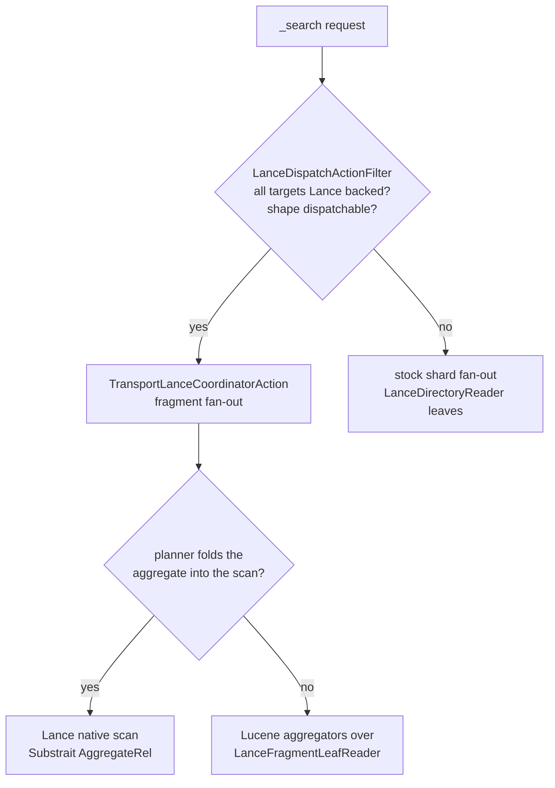
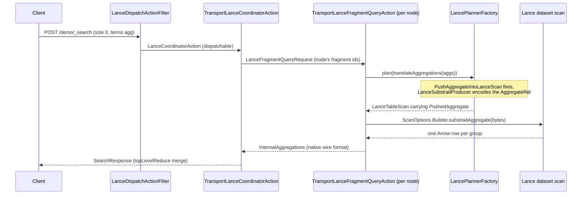
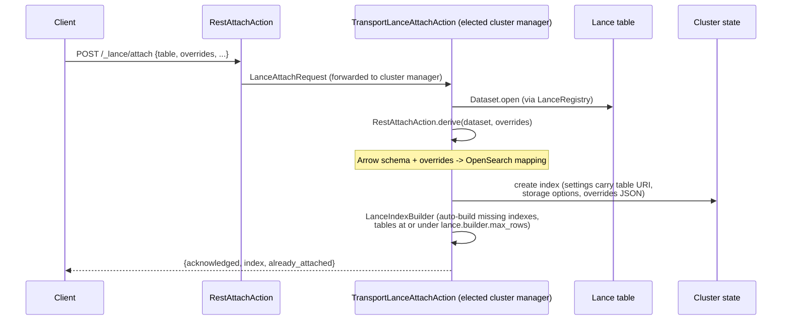
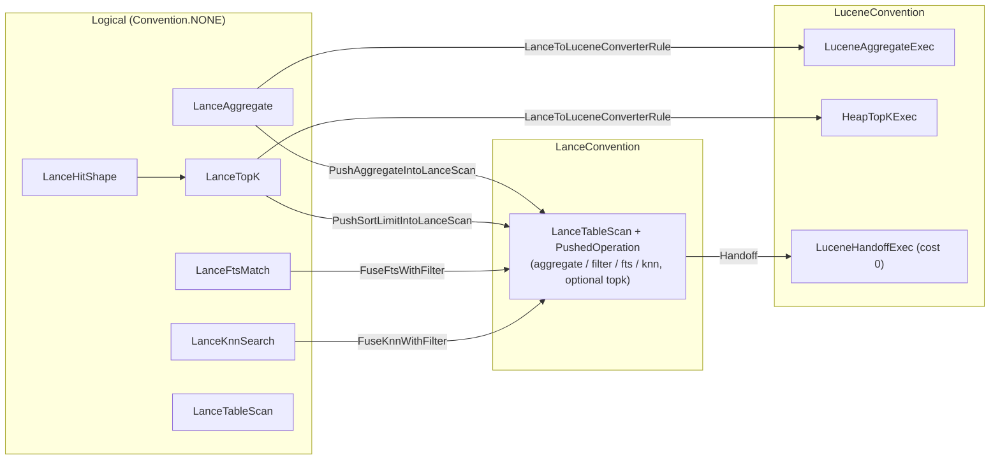

# Architecture

A developer guide to the code under `src/main/java/org/opensearch/lance/`: where each concern
lives, how a request travels from the REST layer to a Lance native scan, and which files a typical
change touches. Read this before your first pull request; read it again when you review one. The
goal is that after thirty minutes here you can place any diff on the map and, for example, add a
planner rule under `plan/rules/` without a guided tour.

Unlike the other documents in `docs/`, prose in this file is wrapped at around 100 columns so that
review diffs stay line-scoped.

## Contents

- [Overview](#overview)
- [Directory layout](#directory-layout)
- [Request flow: an aggregation](#request-flow-an-aggregation)
- [Request flow: hits](#request-flow-hits)
- [Attach and namespace flow](#attach-and-namespace-flow)
- [Planner architecture](#planner-architecture)
- [Storage and follow-forward](#storage-and-follow-forward)
- [Extension points](#extension-points)
- [Testing structure](#testing-structure)
- [Reading a PR](#reading-a-pr)
- [Reference links](#reference-links)

## Overview

This plugin registers a Lance table as a read-only OpenSearch index without copying data out of
Lance. An operator attaches one table (`POST /_lance/attach`) or registers a catalog
(`POST /_lance/namespace`), the plugin derives an OpenSearch mapping from the table's Arrow
schema, and from then on `_search`, `GET /_doc/{id}`, `_count` and the monitoring APIs answer from
the Lance table directly. As the table's manifest advances, the index follows it forward without a
shard close or reallocation.

Search requests answer through one of two routes. The fragment path intercepts `_search` before
OpenSearch's shard fan-out, distributes the table's Lance fragments across the data nodes, and
runs each node's share either natively inside the Lance scan (when the Calcite planner can fold
the request into it) or through Lucene's stock aggregator and collector machinery over
per-fragment leaf readers. The shard path is the stock OpenSearch engine with a Lance-backed
reader, kept as the fallback for request shapes the fragment path does not serve. The planner
exists so that the choice between native execution and Lucene execution is a costed plan
comparison rather than a hand-maintained list of shapes; [Planner architecture](#planner-architecture)
covers it in depth.

The design rationale (why Lance, why fragments as Lucene leaves, why Calcite) lives in
[RFC #22643 on opensearch-project/OpenSearch](https://github.com/opensearch-project/OpenSearch/issues/22643).
In one paragraph: Lance is a columnar table format that ships its own full text and vector
indexes, so vector search, full text search and analytical aggregation can run against one copy of
the data; the plugin's job is to make that copy addressable through OpenSearch's APIs, delegating
to the indexes stored inside the table instead of building a Lucene copy, and to keep following
the table as new versions land. Everything below is a consequence of two commitments in that RFC:
no data leaves Lance (so every read adapts Lance structures to Lucene interfaces at query time),
and stock OpenSearch client behaviour is preserved (so responses are built from the same
`SearchResponse` / `InternalAggregations` types the stock paths produce, and a shape the plugin
cannot serve natively still answers correctly through a fallback).

This document covers where the code is and how it connects. What the plugin can do (query shapes,
mapping coverage, settings) is [features.md](features.md); what it cannot do yet is
[limitations.md](limitations.md); how to run it end to end is
[getting-started.md](getting-started.md). When this document and the code disagree, the code wins;
file an issue or a docs PR.

## Directory layout

Everything lives under one package root. The tree below stops at the subpackage level and names
one or two representative files each; the class Javadoc is the reference for the rest.

```
src/main/java/org/opensearch/lance/
├── LancePlugin.java          # plugin entry point: settings, services, wiring
├── LanceRegistry.java        # process-wide Arrow allocator + shared Lance Session
├── LanceOverrides.java       # per-column mapping override model (type/format/fields/indexes)
├── StorageOptions.java       # per-table object-store credentials, with redaction
├── LanceCircuitBreaker.java  # the lance_native breaker over native memory samples
├── attach/                   # the attach transport action
│   └── TransportLanceAttachAction.java
├── dispatch/                 # search interception, fan-out, per-node execution
│   ├── LanceDispatchActionFilter.java
│   ├── TransportLanceCoordinatorAction.java
│   └── TransportLanceFragmentQueryAction.java
├── engine/                   # Lance-backed Lucene readers and the shard engine
│   ├── LanceFragmentLeafReader.java
│   ├── LanceDirectoryReader.java
│   └── LanceWarmCache.java
├── execute/                  # pushed-aggregate result decoding
│   └── LanceAggregateResults.java
├── index/                    # the build_indexes transport actions
├── mapper/                   # lance_text and lance_vector field types
├── namespace/                # catalog registration, poll loop, drift handling
│   ├── LanceNamespaceService.java
│   └── LanceCatalogEnumerator.java
├── plan/                     # the Calcite planner
│   ├── calcite/              #   conventions, schema, cost, planner factory
│   ├── translate/            #   search body -> logical RelNode
│   ├── rel/                  #   logical nodes + rel/physical/ operators
│   ├── rules/                #   pushdown, fuse and converter rules
│   ├── lancesql/             #   RexNode -> Lance (DataFusion) SQL printer
│   ├── substrait/            #   Calcite Aggregate -> Substrait bytes
│   └── explain/              #   the _lance/explain endpoint
├── query/                    # Lance-specific QueryBuilders and Lucene queries
│   ├── LanceKnnQueryBuilder.java
│   └── LanceFtsQueryBuilder.java
├── refs/                     # the _lance/refs endpoint (tags and branches)
├── rest/                     # all REST handlers
│   └── RestAttachAction.java
└── stats/                    # the _lance/stats endpoint
```

The top-level files are the ones every path shares. `LancePlugin` declares every setting (all
`index.lance.*` and `lance.*` settings are registered in `LancePlugin.getSettings()`), creates the
node-scoped services in `createComponents`, and registers the two thread pools the plugin adds:
`lance_coordinator`, a fixed pool of half the allocated processors with a bounded queue, so
coordination work rejects with 429 under sustained overload instead of queueing without limit, and
a one-thread warm-up pool for `LanceIndexWarmer`. `LanceRegistry` owns the single Arrow allocator
and the single Lance `Session` every `Dataset.open` on the node goes through; sharing one session
keeps Lance's native index and metadata caches node-scoped, where a per-shard `Dataset` would
allocate its own multi-gigabyte caches per shard. `LanceOverrides` is the parsed form of the
`overrides` clause an attach or namespace body carries (accepted types, `format`, keyword
sub-fields, per-column index type preferences), and `StorageOptions` is the parsed form of
`storage_options`; both are consumed at mapping-derive time and persisted in index settings.
`LanceCircuitBreaker` backs the `lance_native` breaker with periodic samples of the native memory
Lance's session holds, because that memory is invisible to the JVM heap accounting every stock
breaker watches.

`attach/` holds `TransportLanceAttachAction`, the cluster-manager scoped action behind
`POST /_lance/attach`. It is deliberately thin on the REST side: the handler that parses the body
lives in `rest/`, and the mapping derivation helpers are static methods on `rest/RestAttachAction`
because the namespace poller reuses them for tables it surfaces on its own. The transport action
owns opening the table, deriving the mapping, creating the index and registering it with the
poller, in that order, behind the action filter chain so a security plugin sees the request first.

`dispatch/` is the fragment path. `LanceDispatchActionFilter` is the routing switch that
intercepts `_search`; `TransportLanceCoordinatorAction` is the shard-free coordinator that fans
fragment groups out across data nodes and merges their answers;
`TransportLanceFragmentQueryAction` is the per-node executor that decides, per request, whether
its share runs as a native Lance scan or through Lucene machinery. `LanceFragmentSearchContext`
and `LanceFragmentIndexSearcher` are the adapters that let OpenSearch's stock aggregators and
collectors run without a real `IndexShard` behind them. `LanceCreateIndexActionFilter` guards the
back door: a bare `PUT /{index}` carrying `index.lance.table` in its settings is rejected, because
it would wire up the engine without the mapping derivation.

`engine/` is everything that makes a Lance fragment readable as a Lucene leaf, shared by both
paths. `LanceFragmentLeafReader` is the heart: one Lucene `LeafReader` per fragment, serving doc
values, stored fields (`_source`, `_id` synthesised from the Lance row), terms and points for
every mapped column kind. `LanceDirectoryReader` composes those leaves into the `DirectoryReader`
the shard path's engine (created by `LanceEngineFactory`) hands to searchers.
`LanceWarmCache` is the node's snapshot cache: the open `Dataset`, fragment list and column store
for a table at one manifest version, keyed by version so concurrent requests on different versions
never share mutable state. `LanceIndexBuilder` creates missing FTS, scalar and vector indexes on
the Lance side; `LanceIndexWarmer` pre-reads index structures into the shared session cache after
a table surfaces.

`execute/` decodes pushed-aggregate results. `LanceAggregateResults` takes the group rows a
Substrait aggregate scan returned and rebuilds the exact `InternalAggregation` objects the Lucene
aggregators would have produced, so the coordinator's reduce cannot tell which route answered.
`CoreAggregationResults` carries the per-request state that pairing needs.

`index/` holds the transport actions behind `POST /_lance/build_indexes/{index}`: a coordinator
action plus per-node actions, since a `node_local` index placement builds on the node that owns
the fragments. `mapper/` defines the two field types the derivation emits for Lance-specific
columns: `lance_text` (`LanceTextFieldMapper`), whose term and match queries rewrite to Lance FTS
execution, and `lance_vector` (`LanceVectorFieldMapper`), a read-only marker type that
`LanceKnnQueryBuilder` validates field names and dimensions against.

`namespace/` is the follow-forward machinery. `LanceNamespaceService` runs the poll loop and owns
the tracking state; `LanceNamespaceFactory` builds the runtime handle per catalog type (directory,
REST, Glue, Iceberg REST, Polaris, Unity); `LanceCatalogEnumerator` walks a catalog's namespace
tree to enumerate tables; `LanceSchemaDriftDetector` classifies schema changes between polls;
`LanceResurfaceGuard` keeps deletion tombstones; `LanceIndexAdopter` rebuilds tracking from index
settings after a restart or failover. The `TransportLanceNamespaceUpdateAction` /
`TransportLanceNamespaceListAction` pair serves the REST mutations and listings.

`plan/` is the Calcite planner, described in its own section below. `query/` holds the plugin's
DSL surface: the `lance_match`, `lance_match_phrase`, `lance_multi_match`, `lance_fts_bool`,
`lance_fts_boost` and `lance_knn` query builders, the Lucene `Query` implementations they rewrite
to on fragment readers (`LanceFtsQuery`, `LanceKnnQuery`, `LanceScanFilterQuery`), and
`FtsAdmission`, the native-memory admission gate for unbounded full text shapes. `refs/` serves
`GET /_lance/refs/{index}` (the table's tags and branches); `stats/` serves `GET /_lance/stats`
(cache occupancy, native memory accounting, warm-up status, admission decisions), with
`LanceStatsCollector` reading the node-scoped caches; `rest/` collects every REST handler in one
place, each one a thin parse-and-forward onto its transport action.

Tests mirror the main tree under `src/test/java/org/opensearch/lance/`. Unit tests are `*Tests`
classes next to the package they cover; REST integration tests are the `Lance*IT` classes at the
package root, driven against a Gradle test cluster; `LanceMultiNodeIT` runs under the separate
`multiNodeIntegTest` task against three nodes. The planner's translator tests are fixture-based:
`src/test/resources/translate/` holds pairs of a request body JSON and the expected plan text. See
[Testing structure](#testing-structure).

## Request flow: an aggregation

Take the canonical analytical request:

```
POST /demo/_search
{ "size": 0, "aggs": { "c": { "terms": { "field": "category" } } } }
```

Three routes can answer it, and the decision points sit at two levels: the action filter decides
fragment path versus shard path per request, and the planner decides native execution versus
Lucene execution per node.



The interception happens in `LanceDispatchActionFilter`, an `ActionFilter` on
`indices:data/read/search` registered by `LancePlugin`. It checks that every resolved target index
is Lance backed and that the request shape is one the fragment executor answers correctly;
suggesters, highlighters, `collapse`, `rescore`, pipeline aggregations, `min_score`,
`terminate_after`, `stored_fields`, `docvalue_fields`, `explain` and score-only `search_after` all
fall through to the shard path via `chain.proceed`, and `LanceAggregationSupport.isSupported`
vets the aggregation tree. A dispatchable request is instead handed to `LanceCoordinatorAction` on
the plugin's `lance_coordinator` thread pool, so a burst of coordination work cannot fill a data
node's `search` queue and a full `search` queue cannot drop a fragment response.

`TransportLanceCoordinatorAction` never touches shards. It resolves the table behind each index
from cluster state, enumerates the table's fragments through the shared `LanceRegistry`, groups
them round-robin across every data node (sorted by node id), and sends one
`LanceFragmentQueryRequest` per node through the transport layer; a single-node cluster takes the
same path with a fan-out of one local hop. A node whose fragments hold more rows than one Lucene
reader may address receives one request per group that fits, so a table of any size stays
searchable. The plugin must be installed on every data node, but a node needs no shard copy of the
index to take a share of the work: the executor builds its query context from cluster state alone.
When every response arrives, the coordinator merges hit lists by the request's sort (or by score)
and reduces the per-node `InternalAggregations` through the stock
`InternalAggregations.topLevelReduce`, producing one `SearchResponse`. The request's timeout
becomes the transport timeout of every per-node request; a node that misses it is reported as
incomplete and the request completes partially (`allow_partial_search_results`, default true) or
fails with 504. The per-node requests are child tasks of the coordinator task, so `_tasks/_cancel`
(or a closed client connection) cancels the executors through the task manager.

On each data node, `TransportLanceFragmentQueryAction` takes the table snapshot for the request's
manifest version from the node's `LanceWarmCache` (which opens the dataset through `LanceRegistry`
on first touch) and decides how to run its fragment share. For an aggregation request the decision
is `resolveAggregatePushdown`: it translates the aggregation tree with
`SearchRequestToRel.translateAggregations`, runs `LancePlannerFactory.plan()` over the logical
tree, and checks whether the physical plan came back as a `LanceTableScan` carrying a
`PushedAggregate`. Guards run before any of that, each returning null to fall back:

- A security plugin's reader wrapper disables the pushdown outright. DLS row filters and FLS field
  masks apply to Lucene readers; a native Lance scan never sees the wrapper, so anything
  wrapper-sensitive must stay on the Lucene route. This gate is first and nothing
  wrapper-sensitive runs past it.
- `lance.aggregation.pushdown` (dynamic, default true) turns the pushdown off.
- The request must be `size: 0` with no `post_filter`, and the query must be scalar: absent,
  `match_all`, or already translated by the coordinator into a Lance SQL filter string. The
  coordinator performs that translation once per request through `QueryToRex.translate` plus
  `RexToLanceSql.print` and ships the result on the request as `filterSql`, so each executor does
  not re-derive it.
- `LanceAggregationSupport.isPushdownCandidate` pre-screens the tree before any planner work.

When the pushdown resolves, the sequence from client to native scan is:



Inside the planner, `PushAggregateIntoLanceScan` matches the `LanceAggregate` over the scan
(directly, over the group-key projection, or over a `Filter`), asks `LanceSubstraitProducer` to
encode the aggregate as a Substrait `AggregateRel`, and replaces the whole tree with the scan
carrying the encoded bytes. The executor hands those bytes to
`ScanOptions.Builder.substraitAggregate` (the call site is `LanceAggregateResults`), Lance's
embedded DataFusion engine computes the groups natively over the node's fragments, and
`LanceAggregateResults` turns the returned group rows into the same `InternalAggregation` objects
the Lucene aggregators would have built. The scan's filter never travels inside the aggregate
bytes; Lance takes it separately through `ScanOptions.filter`, which is why the coordinator's
`filterSql` and the pushed aggregate compose without the producer knowing about predicates.

When the planner cannot fold the aggregate (an unsupported function, a security wrapper, a
non-scalar query), the same Volcano run produces a `LuceneAggregateExec` root instead, and the
executor runs OpenSearch's stock aggregators (`SumAggregator`, the terms and histogram bucket
aggregators, and so on) over the per-fragment `LanceFragmentLeafReader` bundle, using
`LanceFragmentSearchContext` as the minimal `SearchContext` the aggregator machinery requires;
OpenSearch's `DefaultSearchContext` is bound to a full `IndexShard` lifecycle the fragment handler
does not have. The response shape is identical; only where the grouping happened differs.
`hits.total` never consults the aggregators on either route: it comes from Lance's metadata path,
`Fragment.countRows()` sums when no filter is set and `Dataset.countRows(filter)` otherwise.

The third route is the shard path: when the filter declines the request, OpenSearch's regular
shard fan-out proceeds, and each shard's searcher reads through `LanceDirectoryReader`, whose
leaves are the same fragment readers. This route respects everything stock OpenSearch does (it is
stock OpenSearch), at the cost of one node owning the whole table's read. A table with more rows
than one Lucene reader may hold (`IndexWriter.MAX_DOCS`) cannot be one reader, so
`LanceDispatchActionFilter.proceedOnShardPath` fails such a request with 400 rather than letting a
partial reader return silently wrong answers. The shard path is a correctness fallback, never a
load-shedding target.

## Request flow: hits

A hits request follows the same interception and fan-out, with a different plan shape:

```
POST /demo/_search
{ "size": 10, "sort": [{"price": "asc"}], "search_after": [499] }
```

On the executor, `resolvePlannedTopK` builds the query root with
`SearchRequestToRel.translateQuery`, resolves the sort clauses to Calcite collations through
`SortResolution.collationsOf`, wraps the root in a `LanceTopK` carrying the collations, the page
size and the `search_after` cursor, and runs `LancePlannerFactory.plan()`. When
`PushSortLimitIntoLanceScan` fires, the physical plan is the scan carrying a `PushedTopK`: the
executor then issues one ordered, limited Lance scan (`ScanOptions` with the resolved
`ColumnOrdering`s and the page size as the limit), with the cursor spelled as a strict SQL bound
ANDed into the scan filter by `plannedScanFilter`. Lance returns the page already ordered and cut,
so nothing sorts on the Java heap.

The guards on this route mirror what the fold can reproduce, and each one falls back rather than
failing. `size` must be positive with no `post_filter` and no aggregations (both need the full
match set on the Lucene side). Every Lucene `SortField` OpenSearch built from the request must be
a plain numeric or ordinal field-data shape, because the executor types the response's sort values
from them. An `ip` sort is excluded: address order is not the stored strings' order. The query
must be scalar (absent, `match_all`, or the coordinator's `filterSql`). And a `search_after`
cursor equal to a sort field's missing-value sentinel stays on Lucene, whose comparator knows the
sentinel where a strict SQL bound would confuse it with a stored value.

When the fold refuses, the converter rules produce a `HeapTopKExec` alternative and the executor
answers through Lucene's `TopFieldCollector` over the fragment readers, exactly as a stock shard
would. Either way the hit envelope (`_source`, `_id`, sort values) is materialised through the
fragment readers' stored-fields path (`LanceFragmentLeafReader.materialiseStoredFields`);
`LanceHitShape`, the node at the top of every hits plan, records which envelope parts the response
renders but does not yet drive a projection.

Full text and vector clauses join this flow as query roots rather than filters.
`SearchRequestToRel.translateQuery` turns a top-level `lance_match` family clause into a
`LanceFtsMatch` node and a `lance_knn` clause into a `LanceKnnSearch` node, each optionally over a
`Filter` carrying the scalar companions of the enclosing `bool` (or the knn clause's inner
`filter`). The fuse rules (`FuseFtsWithFilter`, `FuseKnnWithFilter`) fold node and filter together
into the scan as a `PushedFts` / `PushedKnn`, with the filter printed as a Lance prefilter,
evaluated before the inverted-index lookup or the vector top-k cutoff; a knn post-filter would
drop rows from the k nearest and return fewer than k, which is why the prefilter position is part
of the contract. A `_score` sort is not a column ordering: an FTS or knn scan produces score order
by itself, so the top-k pushdown accepts a score collation only when the chain carries the FTS or
knn node that produces it, and any sort mixing `_score` with a column stays on Lucene's
`TopFieldCollector`.

## Attach and namespace flow

Attach is a cluster-manager operation with a thin REST front. `rest/RestAttachAction` only parses
the body (table URI, `overrides`, `storage_options`, `version` or `tag`) and forwards a
`LanceAttachRequest`; everything that touches the table happens in
`attach/TransportLanceAttachAction`, so a security plugin evaluates `cluster:admin/lance/attach`
before the plugin opens anything. The action is cluster-manager scoped: whichever node receives
the request forwards it to the elected cluster manager, which runs the operation.



The derivation step is the static `RestAttachAction.derive(Dataset, LanceOverrides, boolean)`
family: it walks the Arrow schema, maps each column to an OpenSearch field type (Utf8 with an FTS
index becomes `lance_text`, Utf8 without one becomes `keyword`, fixed-size float lists become
`knn_vector`, and so on; the full table is in [features.md](features.md)), and applies the
caller's overrides. The boolean selects lenient mode, which the namespace poller uses so one
table's unmappable column does not fail a whole catalog surface. The result is written as the
index mapping, and the inputs that produced it are persisted in index settings
(`index.lance.table`, `index.lance.overrides`, `index.lance.storage_options.*`), so every later
re-derivation starts from the same declarations. After the index exists, `LanceIndexBuilder`
builds any missing FTS, scalar or vector indexes on the Lance side for tables at or under
`lance.builder.max_rows` rows, committing them back to the table as CreateIndex transactions and
reporting per column what was built, skipped or failed.

Namespace registration generalises attach to a catalog. `POST /_lance/namespace` (handled by
`rest/RestNamespaceAction` and `namespace/TransportLanceNamespaceUpdateAction`) stores a
registration in cluster state custom metadata (`LanceNamespaceMetadata`); the runtime handle
behind it is a `LanceNamespace` built by `LanceNamespaceFactory`, with implementations for
filesystem directories, Lance Namespace REST catalogs, AWS Glue, Iceberg REST, Polaris and Unity.
`LanceNamespaceService` then runs the follow-forward loop:

- `poll()` is scheduled with `threadPool.scheduleWithFixedDelay` at `lance.namespace.poll_cadence`
  (default 10 s) on the generic pool, and runs only on the elected cluster manager, so a large
  cluster does not stampede the catalog or starve the master service with concurrent state
  updates.
- Each cycle walks every registration's tables through `LanceCatalogEnumerator` (depth-first over
  nested namespaces, bounded by the registration's `max_namespace_depth` config; implementations
  disagree on how the root namespace is addressed, so the walk tries the known root shapes in
  turn), surfaces new tables as indexes through the same derive-and-create path attach uses, and
  advances existing indexes whose manifest version moved, swapping the shard reader without
  closing the index.
- A catalog that fails to initialise or list is marked unavailable (visible as
  `"status": "unavailable"` in `GET /_lance/namespace`) and retried every cycle; success clears
  the mark. Failures are warned once, not per cycle.
- Deletion honours the operator: `LanceResurfaceGuard` records a tombstone when a Lance-backed
  index is deleted through `DELETE /{index}`, and the poll skips resurfacing that name for
  `lance.namespace.resurface_guard_grace` (default 1 h). Without it, the next cycle would recreate
  the index because the table is still in the catalog.
- Schema drift is `LanceSchemaDriftDetector`'s job. Every derived field carries the Lance
  immutable field id and an Arrow type fingerprint in its mapping meta; the detector compares them
  against the current schema and handles renames (the mapping gains the new name and
  `index.lance.overrides` entries re-key to follow the column), resets (the mapping re-derives; an
  index rebuild happens only when PutMapping cannot merge the type change) and drops (the stale
  name is marked `lance_dropped` and queries against it answer zero hits).
- `LanceIndexAdopter` rebuilds the poll's in-memory tracking from index settings after a restart,
  a manager failover or a snapshot restore. Cluster state keeps `index.lance.table`,
  `index.lance.tag` and the storage options across all three, so nothing needs to be
  re-registered; the poll takes back any Lance-backed index it does not track yet, except indexes
  pinned with `index.lance.version`, which never advance.

Indexes created by plain attach also join the poll's append coverage (the service tracks them in
its `attachedIndexes` map), so an append to an attach-only table surfaces through `_search`
without a manual refresh.

## Planner architecture

The planner turns "which execution strategy answers this request" from a per-shape routing table
into a costed comparison inside Apache Calcite's Volcano planner. Everything lives under `plan/`.
The plugin does not use Calcite's SQL parser, JDBC stack or `EnumerableConvention` (no Janino code
generation); it uses the planner core, the `RelNode` algebra and the cost machinery, with its own
conventions and its own execution.

### Conventions

A Calcite convention marks where an operator executes. The plugin defines three, all in
`plan/calcite/`:

- `LanceConvention`: operators the Lance native scan computes. The only member today is
  `LanceTableScan` once it carries pushed operations.
- `LuceneConvention`: operators that execute through Lucene's aggregator and collector machinery
  over the per-fragment leaf readers.
- `ShardPathConvention`: operators that answer through OpenSearch's regular shard search path. The
  convention class and its `ShardPathRel` marker interface exist, but no operator or rule produces
  them yet; the seat is reserved for making the shard-path fallback a plan alternative the planner
  costs, instead of a pre-planner routing decision in the action filter.

`LancePlannerFactory.newCluster()` registers `ConventionTraitDef` with a fresh `VolcanoPlanner`
per plan construction; registering the trait def is what makes conventions available, and the
individual conventions need no registration of their own. The factory is stateless apart from the
cost budgets it is constructed with (the node's native and heap budgets, fed to
`LanceCostFactory`), so one instance serves concurrent requests, and every call builds fresh
planner objects. The type factory uses `LanceTypeSystem.INSTANCE` so timestamp precision above
three and the unsigned-64-bit `DECIMAL(20, 0)` survive translation. Conversions between
conventions are expressed only by dedicated converter rules, never Calcite's abstract converters.

### Logical rel types

`plan/rel/` holds the logical vocabulary the translator produces:

- `LanceTableScan`: the leaf every plan starts from. It carries an immutable list of
  `PushedOperation`s; a scan with a pushed aggregate stands in for the whole aggregate it
  replaced, so its row type is the aggregate's row type and its row estimate is the aggregate's
  group estimate.
- `LanceAggregate`: Calcite's `Aggregate` plus the OpenSearch semantics it does not model, one
  `BucketSpec` per group key and one `MetricSpec` per aggregate call. A nested bucket tree
  (`terms > terms > avg`) is one aggregate whose group set has one key per level; Calcite has no
  notion of nested aggregations, and the executor rebuilds the tree from the flat groups.
- `LanceFtsMatch` / `LanceKnnSearch`: the logical forms of a top-level Lance FTS clause and a
  `lance_knn` clause, carrying the parsed query builders the executor later turns into the Lance
  `FullTextQuery` or nearest query. Their row types gain the `_score` / `_distance` column.
- `LanceTopK`: the sort collations, page size (`fetch`, the per-node page the coordinator asked
  for) and `search_after` cursor of a hits page.
- `LanceHitShape`: which parts of the hits envelope (`_source`, `_id`, score, sort values) the
  response renders, at the top of every hits plan.

`PushedOperation` is a sealed interface with exactly five permits: `PushedAggregate`,
`PushedFilter`, `PushedFts`, `PushedKnn` and `PushedTopK`. The invariant, enforced by every
`LanceTableScan.withPushed*` method, is that a scan carries at most one query kind (aggregate,
filter, FTS or knn) plus optionally a `PushedTopK` cutting that query's page, and an aggregate
never combines with a top-k, because an aggregate consumes every matching row. Each permit's
`toString` prints its full parameters, so two scans with different pushed operations have
different digests (Volcano deduplicates by digest) and the explain output names exactly what was
pushed.

### Physical rel types

`plan/rel/physical/` holds the `LuceneConvention` operators:

- `LuceneAggregateExec`: the aggregate answered by Lucene's stock aggregators over the fragment
  readers. It wraps the `LanceAggregate` it stands in for (with the aggregate's input rebuilt to
  the concrete projection / filter / scan tree, exactly as a pushed aggregate carries it) and
  takes the bare scan as its input, because the aggregators consume the fragment readers the scan
  exposes.
- `HeapTopKExec`: the hits page ordered and cut on the Java heap by Lucene's top docs collector.
  It wraps the `LanceTopK` it stands in for and the `LanceHitShape` folded with it when the plan
  carried one.
- `LuceneHandoffExec`: a zero-cost converter from `LanceConvention` to `LuceneConvention`. The
  planner demands one convention at the root; without this node, a plan the pushdown rules folded
  entirely into the scan could never satisfy a `LuceneConvention` root, and the planner would
  refuse exactly the plans it should prefer. It moves no rows and does no work.

Both `Exec` operators carry a constant cost pinned above the handoff's zero, so whenever both
forms exist the pushed scan wins the comparison. Today they name the executor's existing Lucene
code paths rather than driving execution through a physical-tree walk. Planned work extends this
in stages: an executor that traverses the physical tree, fan-out and merge as plan operators, a
`ShardPathConvention` fallback operator (retiring the action filter's shape checks), a cost model
fitted from Lance table statistics instead of constants, and accuracy and tie-stability as planner
traits a request can demand.

### Rules

`plan/rules/` registers 38 rule configurations across six rule classes, all in
`LancePlannerFactory.newCluster()`:

| Rule class | Configs | What it folds |
|---|---|---|
| `PushAggregateIntoLanceScan` | 3 | aggregate over scan, over project, over filter |
| `PushFilterIntoLanceScan` | 2 | filter over scan, project over filter over scan |
| `FuseFtsWithFilter` | 2 | FTS node over scan, over filter |
| `FuseKnnWithFilter` | 2 | knn node over scan, over filter |
| `PushSortLimitIntoLanceScan` | 12 | top-k (with/without hit shape) over 6 query chains |
| `LanceToLuceneConverterRule` | 17 | 16 chains to `Exec` operators, plus the `Handoff` converter |

The pattern every rule follows is chain enumeration: each config's operand tree spells one
concrete logical chain ending in a bare `LanceTableScan` operand
(`scan.pushedOperations().isEmpty()`), and `onMatch` folds the whole matched chain in one call.
`PushSortLimitIntoLanceScan.rules()` is the clearest example: six query chains (nothing, `Filter`,
`LanceFtsMatch`, `LanceFtsMatch` over `Filter`, `LanceKnnSearch`, `LanceKnnSearch` over `Filter`),
each with and without the `LanceHitShape` envelope, yields twelve configs built by one recursive
operand builder.

The pattern is deliberate, for two reasons. First, Volcano matches a rule's child operands against
the trait subset the parent registered with, so a rule matching "anything over a scan" would race
the scan's convention change; requiring the concrete chain with the bare scan at the bottom keeps
every match unambiguous. Second, it guarantees termination: every rewrite's output is a scan
carrying pushed operations, which no operand matches, so a rule can never fire on its own output.
When you add a query chain to one pushdown rule, check whether `LanceToLuceneConverterRule` needs
the mirror chain; its aggregate chains intentionally mirror what the translator builds and its
top-k chains mirror `PushSortLimitIntoLanceScan`'s, because that is how both physical forms of
the same logical tree reach the root for the cost comparison.

Two support classes round the package out: `SortResolution` maps OpenSearch sort clauses to
Calcite collations and Lance `ColumnOrdering`s and spells `search_after` cursors as strict
predicates, and the rules share it with the executor so both sides agree on what is resolvable.

### Flow through the planner

The translators in `plan/translate/` are the entry. `SearchRequestToRel.translateAggregations` and
`translateQuery` build the logical tree over a `RelBuilder` from
`LancePlannerFactory.relBuilder(schema)`, whose `scan("lance", index)` call resolves through
`LanceSchema` / `LanceTable` (a Calcite `TranslatableTable`) to a `LanceTableScan`. `QueryToRex`
turns a `QueryBuilder` into a `RexNode` predicate with the same semantics the equivalent Lucene
query has, including the subtle ones: `must_not` negates without excluding rows that have no value
(`NOT (x IS TRUE)`), and `should` is required only when no `must` / `filter` exists, as
`BooleanQuery` behaves without `minimum_should_match`. `AggregationToRel` turns the aggregation
tree into one `LanceAggregate`, encoding group keys as expressions per bucket level (a field
reference for `terms`, `FLOOR(col / interval)` for histograms, `LANCE_DATE_TRUNC` for calendar
date histograms). `plan/lancesql/RexToLanceSql` is the single source of the Lance (DataFusion) SQL
spelling every pushed filter uses; each construct it prints is pinned by a unit test, and a
predicate it cannot spell simply returns empty, which reads as "this filter stays on the Lucene
side".

Anything outside the supported set throws `UnsupportedOperationException` naming the first
unsupported element (`query type [match]`, `aggregation type [top_hits]`, `sort type
[_geo_distance]`, ...); the fragment executor treats that as "not planned" and falls back, while
the explain endpoint surfaces the message in its 400 body, making the message shape part of the
endpoint's contract.

`LancePlannerFactory.plan(logical)` runs Volcano demanding `LuceneConvention` at the root. Three
outcomes exist. A tree the pushdown rules folded arrives as a `LuceneHandoffExec` over the pushed
scan, which `plan()` unwraps so the caller reads the scan and its pushed operations directly. A
tree they could not fold arrives as the `LuceneAggregateExec` / `HeapTopKExec` alternative. And
when neither form exists or planning fails, `plan()` catches `CannotPlanException` (and any other
planner failure, with one warning log) and returns the logical plan itself: the caller reads the
root's type to see what was planned, and the fragment routing promises a Lucene fallback for every
plan it does not push, so a planner failure never surfaces as a request error.

The relationships in one picture:



### The explain endpoint

`GET /{index}/_lance/explain` (in `plan/explain/`, served by `TransportLanceExplainAction`) takes
a search body, runs the same translate-and-plan pipeline without executing anything (no Lance scan
is issued), and returns the logical and physical plan texts. It is the first thing to reach for
when developing a rule: the physical root tells you which convention won, and the scan's digest
names every pushed operation with its parameters. A body outside the supported shape answers 400
carrying the translator's message, which makes the endpoint double as a quick probe of translator
coverage. The model build and translation run on the `lance_coordinator` pool, because building
the model on a cold node opens the Lance table and neither metadata I/O nor CPU-bound translation
belongs on a transport thread.

## Storage and follow-forward

Per-table credentials flow through one type. The `storage_options` map on an attach or namespace
body is parsed into `StorageOptions`, persisted under the `index.lance.storage_options.` settings
prefix, and handed to Lance's object store on every
`LanceRegistry.openDataset(uri, storageOptions)` call. The keys are Lance's own names
(`aws_access_key_id`, `aws_region`, `aws_endpoint`, `allow_http`, ...) with no OpenSearch-side
translation, so what the caller writes is what Lance's object store sees, and one JVM addresses
multiple buckets with different credentials. Values under credential-like key names (`secret`,
`password`, `token`, `key`, `authorization`, `credential`) never leave the node readable:
`StorageOptions` redacts them to `***` in `toString`, and the namespace listing, the cluster state
API rendering and every log line follow the same rule. Only gateway-persisted cluster state keeps
the raw values, so catalogs re-initialise and tables reopen after a full cluster restart.

Freshness is the poll loop's contract. By default an index follows the table's latest manifest
version: the poll notices an advance and swaps the shard reader; on the fragment path,
`LanceWarmCache` keys its snapshots (open `Dataset`, fragment list, column store) by manifest
version, so an in-flight request keeps reading the version it started on and the next request sees
the new one. `"version": N` on attach pins a readonly snapshot that never advances; `"tag":
"name"` follows a Lance tag, re-resolved every cycle, and is dynamic (`index.lance.tag`) so an
operator can repoint an index with `PUT /{index}/_settings`. The fragment path and the engine path
(GET by id, `_count`) do not share a freshness view, because the engine's reader advances with the
poll cadence while the fragment path reads the latest version per query;
[limitations.md](limitations.md) spells out the gap.

Schema drift ties into the same cycle, as described in
[Attach and namespace flow](#attach-and-namespace-flow): the field-id fingerprints in mapping meta
let the poll distinguish a rename from a reset from a drop, follow the operator's overrides across
renames, and warn exactly once per observation.

## Extension points

Where to start for the common kinds of change:

**A new mapping override type** (like the existing `ip`, `wildcard` or `geo_point`). Add the
accepted type to `LanceOverrides` (the `TYPE_*` constants and the parse validation), teach the
derive step in `rest/RestAttachAction` to map the annotated Arrow column and to refuse Arrow
shapes the type cannot serve (a 400 naming the column and its type), add the column kind to
`engine/LanceFragmentSchema`, and implement the read path in `engine/LanceFragmentLeafReader`
(doc values, stored fields, and whatever query support the type needs). Decide explicitly whether
predicates on the new type may print as Lance SQL; when the encoded order differs from the stored
order (as with `ip`), they must not, and the scan runs unfiltered with Lucene evaluating the
predicate. Cover it with a `Lance*IT` and document it in the Mapping overrides section of
[features.md](features.md), with any gaps in [limitations.md](limitations.md).

**A new planner rule.** Put it in `plan/rules/` with a static `rules()` method returning its
configs, register the loop in `LancePlannerFactory.newCluster()`, and follow the chain-enumeration
pattern: every operand path must end in the bare-scan operand, and `onMatch` folds the whole
matched chain in one call. If the rule creates a new foldable shape, add the mirror chain to
`LanceToLuceneConverterRule` so the Lucene alternative still reaches the root. Pin the behaviour
with a `*Tests` class next to the existing rule tests and, if the observable plan changes, a
fixture pair under `src/test/resources/translate/`. Verify with
`GET /{index}/_lance/explain` that the rule fires on the shapes you expect and, just as
important, does not fire on the ones you did not.

**A new physical operator or convention.** Add the operator under `plan/rel/physical/`
implementing the convention's marker interface (`LanceRel`, `LuceneRel` or `ShardPathRel`),
produce it from a converter rule, and keep its cost relationship to `LuceneHandoffExec` explicit;
the zero-cost handoff is the reference point the whole comparison hangs off, so an operator priced
below it would beat plans that fold entirely into the scan.

**A new query builder.** Model it on the existing `query/Lance*QueryBuilder` classes: implement
the builder with its wire serialisation, register it in `LancePlugin.getQueries()`, and
add shape detection to `SearchRequestToRel.translateQuery` if the planner should see it. Unit
tests for serialisation and equality plus a `Lance*IT` for end-to-end behaviour.

**A new Lance index type.** Extend the type switches in `engine/LanceIndexBuilder` (scalar and
vector type names resolve there from the `indexes` clause, with per-type parameter validation),
and update the index type selection table in [features.md](features.md).

**A new setting.** Declare it on `LancePlugin`, add it to `getSettings()` (OpenSearch rejects a
setting no plugin registered), and give it one line in the relevant page under `docs/`.

## Testing structure

Four layers, three of them in-repo:

**Unit tests** (`./gradlew test`) are the `*Tests` classes, extending `OpenSearchTestCase`. The
planner has the densest coverage here, and much of it is fixture-based:
`LanceQueryShapeFixtureTests`, `AggregationToRelFixtureTests` and `PlannerFixturePhysicalTests`
read request bodies from `src/test/resources/translate/{queries,aggregations}/*.json` and compare
the produced plan against the sibling `*.plan` text. Adding a translator or rule behaviour usually
means adding one JSON body and its expected plan, which keeps the assertion at the level reviewers
actually read: the plan text itself. Rule mechanics that fixtures cannot express (refusals,
digest uniqueness, cost comparisons) live in the per-rule `*Tests` classes under
`src/test/java/org/opensearch/lance/plan/`.

**Integration tests** (`./gradlew integTest`) are the `Lance*IT` classes extending
`LanceRestTestCase`, run against a single-node Gradle test cluster with the plugin installed. The
standing pattern is: create a Lance table on local disk through the test fixtures, attach it, and
drive queries over REST, asserting on response JSON. Class names must end in `IT` (and unit
classes in `Tests`); Gradle's task wiring only picks those patterns up, so a class named anything
else silently never runs.

**Multi-node integration tests** (`./gradlew multiNodeIntegTest`) run `LanceMultiNodeIT` against a
three-node cluster to pin the coordinator's fan-out and merge behaviour: fragment grouping across
nodes, partial results on node timeout, aggregation reduce over per-node partials. The default
`integTest` stays single-node to keep the dev cycle short; run this suite when you change anything
in `dispatch/`.

**Performance and acceptance QA** runs outside the repo, on EC2 fleets against tables in the
billion-row range, measuring latency and correctness per release round. Repo-side changes do not
interact with it directly, but a change to the fragment executor or the pushdown surface should
expect its numbers to be re-measured.

For runtime inspection during development, `GET /{index}/_lance/explain` shows what the planner
did, and `GET /_lance/stats` shows the node-side caches, native memory accounting and admission
decisions.

## Reading a PR

The mental map for placing a change quickly, by the patterns that recur:

- **A planner rule or translator change** touches `plan/rules/*`, `plan/rel/*`, the registration
  loop in `LancePlannerFactory.newCluster()`, shape detection in `SearchRequestToRel`, possibly
  `plan/lancesql/RexToLanceSql` (when a new predicate must print as Lance SQL), and translator
  fixtures. It should barely touch `dispatch/`; when it does more than read a plan's root, ask why
  the routing needed to know.
- **A mapping override or field type change** touches `LanceOverrides`, the derive step in
  `rest/RestAttachAction`, `engine/LanceFragmentSchema` and `engine/LanceFragmentLeafReader`, plus
  `docs/features.md` and `docs/limitations.md`. Read the leaf reader part first; that is where
  correctness lives.
- **A catalog integration** touches `namespace/LanceNamespaceFactory`,
  `namespace/LanceCatalogEnumerator`, `build.gradle` (the dependency, its third-party audit
  entries, and `licenses/` files generated by `./gradlew updateSHAs`) and the namespace section of
  `docs/features.md`. Cluster state shapes should not change for a new catalog type.
- **An executor or fan-out change** touches the three largest files in the repo:
  `dispatch/TransportLanceFragmentQueryAction.java` (about 2,900 lines),
  `dispatch/TransportLanceCoordinatorAction.java` (about 1,700 lines) and
  `engine/LanceFragmentLeafReader.java` (about 4,000 lines, the read path of every column kind).
  These are the repo's hot files: review them method-by-method, and expect only one in-flight PR
  at a time to touch each.

Red flags worth calling out in review, each one a class of bug this codebase has explicit
defences against:

- A rule whose operand tree does not bottom out in the bare-scan predicate. It can loop or
  mis-match under Volcano's trait-subset matching; the termination argument of every existing rule
  depends on that operand.
- A new `PushedOperation` variant added without extending the sealed interface's permits and the
  `withPushed*` invariant checks, or a permit combination the mutual-exclusion invariant forbids.
- Blocking work in a REST handler or on a transport thread: `Dataset.open`, `actionGet()`,
  latches, filesystem or network I/O. Handlers parse and forward; transport actions fork to the
  right pool.
- A fragment-path feature that skips the security wrapper gate. Anything a DLS/FLS wrapper cannot
  see must stay on the searcher route; the aggregation pushdown's wrapper check is the pattern to
  copy.
- A new node-visible surface (setting, endpoint, response field) without its line in `docs/`.

## Reference links

In this repository:

- [features.md](features.md) — what each surface does, by concern.
- [limitations.md](limitations.md) — known gaps and shard-path fall-throughs.
- [getting-started.md](getting-started.md) — end-to-end walkthrough.
- [CHANGELOG.md](../CHANGELOG.md) — release notes.
- Class-level Javadoc — the per-file reference this document deliberately stops short of;
  `LancePlugin`, `TransportLanceCoordinatorAction`, `LancePlannerFactory` and
  `LanceNamespaceService` carry the longest ones.

Outside:

- [RFC #22643](https://github.com/opensearch-project/OpenSearch/issues/22643) — the design
  discussion and rationale.
- [Lance](https://github.com/lancedb/lance) — the table format; `rust/lance/src/dataset/scanner.rs`
  is where the pushed Substrait aggregate and the ordered, limited scan execute.
- [lance-namespace](https://github.com/lancedb/lance-namespace) — the catalog API the namespace
  implementations build on.
- [Apache Calcite](https://calcite.apache.org/) — the planner; the `VolcanoPlanner` and `RelRule`
  documentation explains the machinery `plan/` builds on.
